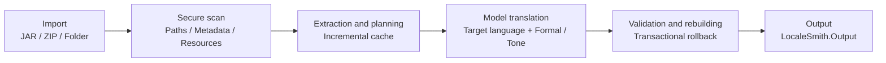

<!-- markdownlint-disable MD013 MD033 MD041 -->

<div align="center">
  

  <h1>LocaleSmith | 译匠</h1>

  <p><a href="./README.md">简体中文</a> · <strong>English</strong></p>

  <p><strong>A native Windows AI localization workbench for Minecraft: Java Edition content</strong></p>
  <p>Safely scan mods and resource packs, connect to local or cloud models, and generate localized artifacts through a verifiable, rollback-capable pipeline.</p>

  <p>
    <a href="./LICENSE"></a>
    <a href="./global.json"></a>
    <a href="./rust-toolchain.toml"></a>
    
    
    
  </p>

  <p>
    
    
    
    
    
  </p>

  <p>
    <a href="#project-overview">Project Overview</a> ·
    <a href="#core-capabilities">Core Capabilities</a> ·
    <a href="#supported-scope">Supported Scope</a> ·
    <a href="#processing-pipeline">Processing Pipeline</a> ·
    <a href="#quick-start">Quick Start</a> ·
    <a href="#security-boundaries">Security Boundaries</a> ·
    <a href="#contributing">Contributing</a>
  </p>
</div>

> [!IMPORTANT]
> LocaleSmith is currently a **source-buildable development preview**. The existing MSIX uses a self-signed development certificate and has not yet completed production signing, trusted timestamping, or a clean-machine installation test matrix. Do not treat it as a production release.

## Project Overview

**LocaleSmith | 译匠** is designed for Minecraft: Java Edition mods, resource packs, and shader packs, integrating **secure scanning, incremental translation, structural validation, and transactional rebuilding** into a native Windows desktop workbench.

The project combines a native Rust scanning core with a .NET 10 / WinUI 3 desktop application. Rust handles parsing for JARs, ZIPs, Loader metadata, and supported bytecode patterns, while .NET handles archive transactions, model integration, secure storage, translation queues, and the user interface.

## Core Capabilities

| Capability | Description |
| --- | --- |
| **Secure archive scanning** | Detects path traversal, Loader metadata, language resources, signature evidence, and supported Java string references. |
| **Incremental translation pipeline** | Reuses translations by content hash, validates placeholders and structure, and rolls back the entire job on failure. |
| **Specialized prompts and terminology** | Automatically distinguishes mods, resource packs, and shader packs and applies dedicated domain prompts; Simplified Chinese jobs include a specialized terminology glossary for each content type. |
| **Multiple target languages** | Initially supports Simplified Chinese, English, Japanese, French, and Russian; the language catalog is centrally defined and can be extended. |
| **Multiple model integrations** | Provides unified support for Ollama, OpenAI-compatible Chat Completions, and Anthropic Messages. |
| **Provider presets** | Presets for DeepSeek, Qwen, Xiaomi MiMo, MiniMax, OpenAI, Doubao, Zhipu GLM, Kimi, and others fill in the service endpoint and model name and select the recommended completion-token parameter; you can also explicitly omit that parameter. |
| **Persistent diagnostic logs** | When the log directory is writable, each translation attempts to persist a pair of Debug and All levels `.log` files through a bounded background writer; logs can be viewed from the left-hand “Logs” page, and the directory can be changed during onboarding or in Settings. |
| **Native desktop experience** | Provides first-run onboarding, a processing queue, a model assistant, model source management, logs, settings, and CLI risk confirmation. |
| **Credential and configuration protection** | Stores API keys in Windows Credential Manager and encrypts other configuration with AES-256-GCM. |
| **Controlled MCP / CLI** | Models can only read safe context and propose commands; execution requires policy revalidation and explicit user confirmation. |

## Supported Scope

| Category | Current Support |
| --- | --- |
| Input | JAR, ZIP, or an extracted resource-pack or shader-pack directory |
| Loader metadata | Fabric, Forge, NeoForge, Quilt, Legacy Forge |
| Text resources | Minecraft language JSON, Legacy `.lang`, shader-pack `shaders/lang/*.lang`, `pack.txt`, and supported display text in `pack.mcmeta` |
| Bytecode | Exact `Component.literal(String)` patterns proven by structural analysis; other candidates are reported but not rewritten |
| Model APIs | Ollama, OpenAI-compatible Chat Completions, Anthropic Messages |
| Model presets | DeepSeek, Qwen, Xiaomi MiMo, MiniMax, OpenAI, Doubao, Zhipu GLM, Kimi, and a custom entry point |
| Target languages | `zh_CN`, `en_US`, `ja_JP`, `fr_FR`, `ru_RU` |
| Output | One target language and one translation style selected for the current job; resource names inside the package use lowercase Minecraft locales such as `ja_jp` |
| Platform | Windows x64, minimum Windows 10 1809 |

## Processing Pipeline



Each job captures the user's selected target language, model source, and one translation style when it is queued. Language resources prefer `en_us`, `en_gb`, or another existing locale that differs from the target language as source text; for example, if English is the target but the package contains only Japanese, LocaleSmith generates `en_us` from the Japanese source. The other style can be queued separately and can reuse corresponding translations already cached under the same source-text hash.

## Translation Logs and Persistent Settings

The “Logs” page in the left navigation lists persistent records by translation job and displays the Debug view by default; switch to All levels to inspect records across all log levels, including fine-grained progress. Logging is a best-effort background diagnostic feature: when the directory is writable and the writer has capacity, a job creates a pair of `.debug.log` / `.all.log` files and incrementally flushes them to disk. On slow devices or when the queue is full, files or individual diagnostic entries may be skipped, but translation is never blocked. After an abnormal process exit, content that was successfully flushed remains available for identifying the last recorded stage.

The default directory is `%LOCALAPPDATA%\LocaleSmith\logs\translations`. During first-run onboarding and from the “Settings” page, you can browse for or manually enter a local directory. Once saved, a change takes effect with the next translation and is written to the encrypted configuration when the application closes, together with the last valid settings for language, theme, workspace, and other options. The application retains and lists only the latest 500 sessions; cleanup matches only LocaleSmith's own naming format and does not delete other files in the directory. Logs record only the task ID, package file name, stage, progress, result, and error type. They do not record API keys, full prompts, or the parent directory of a user-selected path. Common bearer, token, and API key patterns are redacted again before being written to disk.

## Quick Start

### Prerequisites

| Dependency | Version or Notes |
| --- | --- |
| Operating system | Windows 10 1809 or later; Windows 11 is recommended for WinUI development |
| .NET SDK | `10.0.302`, pinned by `global.json` |
| Rust | Repository toolchain `1.97.1` (MSVC), including `rustfmt` and `clippy` |
| Windows SDK | `10.0.26100`, with MSVC / C++ build tools installed |
| UI dependencies | Windows App SDK `2.3.1` and CommunityToolkit.Mvvm `8.4.2`, restored through NuGet |
| MSIX build | Requires Visual Studio Developer PowerShell with Desktop Bridge / WAP targets |

### Build

Build the Rust release DLL first, then restore and build the .NET solution:

```powershell
git clone https://github.com/DZXH-TX/LocaleSmith.git
Set-Location LocaleSmith

cargo build --manifest-path native/localesmith_core/Cargo.toml --release
dotnet restore LocaleSmith.slnx
dotnet build LocaleSmith.slnx -c Release
```

> [!NOTE]
> `dotnet build LocaleSmith.slnx` does not generate the WAP / MSIX package. The packaging project is located at `packaging/LocaleSmith.Package` and must be built separately in a development environment with the corresponding Visual Studio targets.

<details>
<summary><strong>Run the full validation gate</strong></summary>

```powershell
cargo fmt --manifest-path native/localesmith_core/Cargo.toml --all -- --check
cargo clippy --manifest-path native/localesmith_core/Cargo.toml --all-targets --all-features -- -D warnings
cargo test --manifest-path native/localesmith_core/Cargo.toml --all-targets

dotnet test LocaleSmith.slnx -c Release
dotnet format LocaleSmith.slnx --verify-no-changes --no-restore
```

</details>

## Source Layout

```text
native/localesmith_core/       Rust ZIP/JAR, metadata, and classfile scanning core
src/LocaleSmith.Core/           Domain models and unified service contracts
src/LocaleSmith.NativeInterop/  C ABI projection, DLL resolution, and typed manifests
src/LocaleSmith.Application/    Translation orchestration, incremental planning, queues, and transaction boundaries
src/LocaleSmith.Archive/        Secure snapshots, extraction, rebuilding, validation, and rollback
src/LocaleSmith.Infrastructure/ Model adapters, credentials, encryption, CLI, and environment detection
src/LocaleSmith.Mcp/            MCP JSON-RPC / stdio protocol and tool catalog
src/LocaleSmith.McpHost/        Standalone MCP console host
src/LocaleSmith.Presentation/   Testable MVVM ViewModels and UI contracts
src/LocaleSmith.App/            WinUI 3 views, composition root, and local application services
tests/                      Eight .NET test projects and a restricted CLI probe
packaging/                  x64 WAP / MSIX manifest, bilingual resources, and icons
```

## Security Boundaries

The following principles are part of product behavior, not optional configuration:

- **Models cannot authorize command execution.** Provider tool loops may only read safe context and propose commands. The user must still review the complete command, acknowledge the risk, and explicitly approve it.
- **Signed JAR modification is blocked by default.** The original signature cannot be preserved without the original author's private key; the project either blocks modification or generates an unsigned copy after the user explicitly chooses to do so.
- **The CLI does not search the process PATH.** No process executable is trusted by default; any future explicit allowlist must use approved absolute paths. The private CLI sandbox defaults to `%LOCALAPPDATA%\LocaleSmith\CliSandbox`, with reparse points checked both before and after creation.
- **Low IL is not the same as AppContainer.** A restricted token, private desktop, and Job Object reduce the execution surface, but do not automatically block network access or prevent access to files permitted by the current user's ACLs.

<details>
<summary><strong>Exact scope of bytecode externalization</strong></summary>

Currently, LocaleSmith rewrites only structurally proven, immediately adjacent `ldc` / `ldc_w` strings and Mojang `Component.literal(String):MutableComponent` static calls, converting them into exact `translatable(String)` references. The implementation preserves instruction length and rescans for validation before committing. Patterns that cross branch or exception boundaries, unknown opcodes, obfuscated code, and all other inexact patterns are never rewritten. This is not a general-purpose Java bytecode rewriter, and coverage of a real-world Minecraft / Loader compatibility matrix is not yet available.

</details>

<details>
<summary><strong>Archive rebuilding and signatures</strong></summary>

The original input always remains unchanged, critical metadata and manifests are revalidated, and transaction failures are rolled back. However, ZIP / JAR files are recompressed, so byte-for-byte preservation of compression streams, extra fields, entry comments, or ordering is not guaranteed. Modifying a signed archive invalidates its original signature; re-signing is not currently provided.

</details>

<details>
<summary><strong>Model tool and CLI isolation</strong></summary>

The MCP stdio Host exposes only `system.context` and `cli.propose`, not `cli.execute`. Executable commands must originate from approved absolute paths, pass checks for absolutely prohibited patterns, the working directory, and sensitive arguments, and then be bound to a one-time confirmation token. If the pre-launch audit cannot be written, the process will not start. Kimi's private `reasoning_content` is replayed within bounds only inside the same Kimi tool loop; it never enters user-visible content and is never sent to another provider.

</details>

<details>
<summary><strong>MSIX development package status</strong></summary>

The current manifest version is `0.1.0.2`. Historical development packages in the repository previously completed payload, PRI, MCP Host, SignPath Authenticode signing, and local launch verification, but that evidence does not cover the current source fixes. The current commit requires a newly generated, signed, and installation-verified MSIX. Before submission to the Microsoft Store, the package must also use the official package identity assigned through Partner Center.

</details>

## Validation Snapshot

The following figures are the validation baseline recorded in the current source, not live CI status:

| Check | Baseline |
| --- | --- |
| .NET Release | `391 / 391` tests, `0` warnings, `0` errors |
| Rust | `26 / 26` tests; `rustfmt` and `clippy -D warnings` passed |
| Bilingual resources | `366` keys each for `zh-CN` / `en-US`, fully aligned |
| Source security audit | Regression gates for local paths, archives, CLI, credentials, and migrations passed; GitHub CodeQL results depend on a fresh remote scan of the current commit, and the README does not claim zero alerts |

These results demonstrate the source behavior covered by the current automation. They do not replace external penetration testing, real provider validation, or Minecraft / Loader runtime compatibility testing.

## Contributing

Pull requests are welcome. Before submitting code, run at least the Rust / .NET validation gates relevant to your changes, and clearly state the target Minecraft version, Loader, input type, and model source.

## License

This project is open source under the [Apache License 2.0](./LICENSE).

## Artificial Intelligence Use Statement

This project permits the use of generative artificial intelligence tools for requirements analysis, code and documentation drafting, refactoring suggestions, test design, localization, and similar activities. All AI-assisted output must undergo human review, necessary testing, and security and license verification before submission. Maintainers and contributors remain fully responsible for the correctness, security, compliance, and maintainability of their submissions; AI output does not constitute a factual, legal, or professional guarantee.

When using AI tools, do not upload secrets, credentials, personal information, unpublished source code, or restricted third-party content to unauthorized external services, and comply with the applicable terms of service and third-party licenses. Contributors should accurately disclose AI-assisted content with a material impact on the project in their pull requests. This statement does not alter the licensing, copyright, or contribution ownership established under the Apache License 2.0.

Copyright © 2026 **DZXH-TX（道泽星河-天仙）** (copyright holder and licensor).
