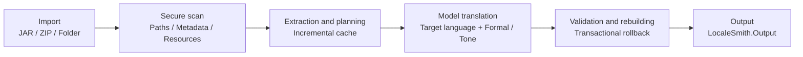

<!-- markdownlint-disable MD013 MD033 MD041 -->

<div align="center">
  

  <h1>LocaleSmith | 译匠</h1>

  <p><a href="./README.md">简体中文</a> · <strong>English</strong></p>

  <p><strong>A native Windows AI localization workbench for Minecraft: Java Edition content</strong></p>
  <p>Safely scan mods and resource packs, connect to local or cloud models, and generate localized artifacts through a verifiable, rollback-capable pipeline.</p>

  <p>
    <a href="./LICENSE"></a>
    <a href="./global.json"></a>
    <a href="./rust-toolchain.toml"></a>
    
    
    <a href="https://apps.microsoft.com/detail/9NP8V6WQNGT0"></a>
  </p>

  <p>
    
    
    
    
    
  </p>

  <p>
    <a href="https://apps.microsoft.com/detail/9NP8V6WQNGT0"><strong>Get it free from Microsoft Store</strong></a>
    ·
    <a href="https://github.com/DZXH-TX/LocaleSmith/releases/tag/v1.1.0">GitHub Release v1.1.0</a>
  </p>

  <p>
    <a href="#quick-start">Quick Start</a> ·
    <a href="#project-overview">Project Overview</a> ·
    <a href="#core-capabilities">Core Capabilities</a> ·
    <a href="#supported-scope">Supported Scope</a> ·
    <a href="#known-limitations">Known Limitations</a> ·
    <a href="#processing-pipeline">Processing Pipeline</a> ·
    <a href="#build-from-source">Build from Source</a> ·
    <a href="#security-boundaries">Security Boundaries</a> ·
    <a href="#contributing">Contributing</a>
  </p>
</div>

## Thirty-second overview

| Focus | Actual behavior |
| --- | --- |
| **Scan before modifying** | The native Rust core parses JAR / ZIP paths, Loader metadata, signature evidence, and language resources; original inputs remain read-only. |
| **Translate only new content** | Content hashes reuse translations while EntryIds, placeholders, and structure are validated; failure/cancellation never commits a partial artifact. |
| **Beyond lang files** | Handles resource/shader language files and structurally proven `Component.literal` externalization; unsafe candidates are reported or skipped. |
| **Choice with control** | Ollama, OpenAI-compatible, and Anthropic; explicit model refresh and Token/batch budgets, with private reasoning replayed only inside the same provider protocol loop. |
| **Credential and execution boundaries** | API keys stay in Credential Manager and configuration uses AES-256-GCM; models can propose commands, but policy and explicit user confirmation still gate execution. |

## Quick Start

### Install

> [!IMPORTANT]
> **Microsoft Store is the recommended installation channel.** It handles framework dependencies and future updates automatically.

<table>
<tr>
<th width="180">Channel</th>
<th>Description</th>
</tr>
<tr>
<td><a href="https://apps.microsoft.com/detail/9NP8V6WQNGT0"><b>Microsoft Store</b></a><br /><sub>Recommended</sub></td>
<td>Free download with automatic dependency installation and updates. Product ID <code>9NP8V6WQNGT0</code></td>
</tr>
<tr>
<td><a href="https://github.com/DZXH-TX/LocaleSmith/releases/tag/v1.1.0"><b>GitHub Release v1.1.0</b></a></td>
<td>Microsoft Marketplace-signed <code>CRTech.LocaleSmith_1.1.0.0_x64.Msix</code>; <b>no development test certificate required</b></td>
</tr>
</table>

<sub>MSIX checksum (SHA-256): <code>A2F24B73D4B20C9255DE32F3A6949251067ADFC53A24A4732C50B96FBBA84F64</code>　·　System requirements: Windows 10 1809 (build 17763) or later, x64</sub>

### Three steps

```text
1. Add packages       →  Select a JAR / ZIP or one extracted directory; multi-archive folders use Add package multi-select
2. Configure a model  →  Choose local Ollama or a cloud preset; only cloud services require their API key
3. Start translation  →  Choose the target language and one style, then queue; output goes to the current Workspace's LocaleSmith.Output
```

> [!NOTE]
> The standalone stdio MCP Host `CRTech.LocaleSmith.McpHost` is published at `0.1.1` and exposes only `system.context` and `cli.propose`. See the [package README](./.github/package-readmes/LocaleSmith.McpHost.md) for installation, GitHub Packages authentication, and client configuration.

## Project Overview

**LocaleSmith | 译匠** is designed for Minecraft: Java Edition mods, resource packs, and shader packs, integrating **secure scanning, incremental translation, structural validation, and transactional rebuilding** into a native Windows desktop workbench.

The project combines a native Rust scanning core with a .NET 10 / WinUI 3 desktop application. Rust handles parsing for JARs, ZIPs, Loader metadata, and supported bytecode patterns, while .NET handles archive transactions, model integration, secure storage, translation queues, and the user interface.

## Core Capabilities

<details open>
<summary><b>Translation and pipeline</b></summary>

<br />

| Capability | Description |
| --- | --- |
| **Secure archive scanning** | Detects path traversal, Loader metadata, language resources, signature evidence, and supported Java string references |
| **Incremental translation pipeline** | Reuses translations by content hash, validates placeholders and structure, and rolls back the entire job on failure |
| **Specialized prompts and terminology** | Distinguishes mods, resource packs, and shader packs and applies dedicated domain prompts; Simplified Chinese jobs include specialized terminology |
| **Multiple target languages** | Simplified Chinese, English, Japanese, French, and Russian; the centrally defined catalog can be extended |
| **Mod project synchronization** | Treats one normalized source artifact as a process-local project and synchronizes its objective, progress, status, and artifacts with the assistant |

</details>

<details open>
<summary><b>Model integration</b></summary>

<br />

| Capability | Description |
| --- | --- |
| **Three protocols** | Ollama · OpenAI-compatible Chat Completions · Anthropic Messages |
| **Provider presets** | DeepSeek, Qwen, Xiaomi MiMo, MiniMax, OpenAI, Doubao, Zhipu GLM, and Kimi fill endpoint, model name, and recommended Token parameters |
| **Model catalog refresh** | Ollama and OpenAI-compatible services exposing `/models` support explicit refresh with manual fallback |
| **Budgets and private reasoning** | Each source sets response Tokens and a translation batch target; providers needing continuity replay private state only within the same protocol loop |
| **Real usage** | Shows only Provider-reported Token usage; completed calls survive failure/cancellation, while missing or partial values are clearly marked and **never estimated** |

</details>

<details>
<summary><b>Desktop experience and operations</b></summary>

<br />

| Capability | Description |
| --- | --- |
| **Native desktop experience** | First-run onboarding, processing queue, model assistant, model-source management, logs, settings, and CLI risk confirmation |
| **Persistent diagnostic logs** | When the directory is writable and the writer has capacity, translation attempts to persist Debug / All levels `.log` pairs; the Logs page and directory setting remain available |
| **Credential and configuration protection** | API keys stay in Windows Credential Manager; other configuration uses AES-256-GCM |
| **Controlled MCP / CLI** | The assistant gets bounded project tools only with an active project; command execution requires policy revalidation and explicit user confirmation |
| **Online mod community** | Browse public mods and discussions; use a Credential Manager PAT for posts, replies, and reports |
| **Microsoft subscription and safe acceleration** | Native Store purchase UI, authoritative backend entitlement, and one-time download grants, with safe fallback to the default source |

</details>

## Supported Scope

<table>
<tr><th width="140">Category</th><th>Current support</th></tr>
<tr><td><b>Input</b></td><td>JAR, ZIP, or one extracted mod / resource-pack / shader-pack directory<br /><sub>Container folders with multiple JAR/ZIP files require Add package multi-select</sub></td></tr>
<tr><td><b>Loader metadata</b></td><td>Fabric · Forge · NeoForge · Quilt · Legacy Forge</td></tr>
<tr><td><b>Text resources</b></td><td>Minecraft language JSON · Legacy <code>.lang</code> · shader-pack <code>shaders/lang/*.lang</code> · <code>pack.txt</code> · supported display text in <code>pack.mcmeta</code></td></tr>
<tr><td><b>Bytecode</b></td><td>Structurally proven <code>Component.literal(String)</code> patterns<br /><sub>Other candidates are reported but not rewritten</sub></td></tr>
<tr><td><b>Model APIs</b></td><td>Ollama · OpenAI-compatible Chat Completions · Anthropic Messages</td></tr>
<tr><td><b>Model presets</b></td><td>DeepSeek · Qwen · Xiaomi MiMo · MiniMax · OpenAI · Doubao · Zhipu GLM · Kimi · custom endpoint</td></tr>
<tr><td><b>Target languages</b></td><td><code>zh_CN</code> · <code>en_US</code> · <code>ja_JP</code> · <code>fr_FR</code> · <code>ru_RU</code></td></tr>
<tr><td><b>Output</b></td><td>One target language + one translation style per job; package resources use lowercase locales such as <code>ja_jp</code></td></tr>
<tr><td><b>Platform</b></td><td>Windows x64, minimum Windows 10 1809</td></tr>
</table>

## Known Limitations

| Limitation | Current boundary |
| --- | --- |
| Quest/script formats | FTB Quests `.snbt`, Better Questing, KubeJS, and CraftTweaker `.zs` are outside the current translation scope. |
| Modpack containers | `.mrpack` and similar modpack formats are not processed as one input; use multi-select Add package for folders containing several JAR/ZIP files. |
| Project persistence | Mod projects, tasks, and project-scoped assistant sessions live only for the current process and are not restored after restart. |
| One output per job | A job freezes one target language and one style; enqueue separate jobs for other languages or styles. |
| Archive recompression | ZIP streams, extra fields, entry order/comments, and original signatures are not guaranteed byte-for-byte identical. |
| Bytecode subset | This is not a general Java rewriter; candidates that exceed narrow `ldc` capacity are safely skipped rather than receiving incomplete control-flow/StackMap rewrites. |
| Runtime matrix | Automated validation is not real in-game certification across Minecraft and Loader versions; test the intended target matrix. |
| Platform | Current deliverables are Windows x64 only, with no Linux, macOS, or ARM64 build. |

## Processing Pipeline



Each job captures the user's selected target language, model source, one translation style, response Token budget, and source-character batch target when it is queued. The character target controls batching for large packages and never truncates one value; HTTP responses remain protected by a fixed, non-configurable 16 MiB safety limit. Language resources prefer `en_us`, `en_gb`, or another existing locale that differs from the target language as source text; for example, if English is the target but the package contains only Japanese, LocaleSmith generates `en_us` from the Japanese source. The other style can be queued separately and can reuse corresponding translations already cached under the same source-text hash.

When a source artifact is added from the Dashboard, LocaleSmith registers or reuses a process-local mod project by normalized source path and synchronizes the active project and its translation tasks with the assistant. The assistant keeps a separate conversation and draft for every `ProjectId + ModelSourceId` pair. Switching projects or model sources restores only the matching session: one mod's history is not mixed into another mod, and history from one provider is not sent to a different provider. The project workspace is currently memory-only and is not restored after the application restarts.

The assistant's processing view contains only deterministic lifecycle events for model-round start/completion, tool start/completion/failure, and the final run state. Events exclude message content, tool arguments/results, paths, commands, exception text, and private `reasoning_content`. Provider-reported token usage is aggregated into assistant responses and translation tasks; completed provider rounds remain visible when a task later fails or is cancelled, while an in-flight call without usage is marked partial or unavailable. A total is shown only when the provider reports it or when both provider-reported input and output counts are present, with no character-count or heuristic estimate.

## Microsoft Store Subscription and Domestic Acceleration

LocaleSmith itself is free. Domestic download acceleration is a separate, optional Microsoft Store subscription.

<details>
<summary><b>Subscription and pricing</b></summary>

<br />

| Item | Current configuration |
| --- | --- |
| Billing | Microsoft (Partner Center) |
| Period | Monthly auto-renewal |
| Trial | Seven days for eligible new subscribers |
| Global base tier | US$4.99/month, localized by the Store |
| China market | CNY 30.00/month |
| Manage or cancel | [Microsoft Services & subscriptions](https://account.microsoft.com/services) |

The client uses `Windows.Services.Store.StoreContext` for Microsoft purchase UI and **shows only the actual renewal price returned for the current region**. These tiers describe the current Partner Center configuration, not a hard-coded client promise. Microsoft Store does not support a native “CNY 24 first month, then CNY 30” introductory price, and LocaleSmith does not simulate one. The [privacy policy](https://dow.dzxh-tx.cn/privacy) remains discoverable.

</details>

<details>
<summary><b>Entitlement verification and download path</b></summary>

<br />

Purchase, restore, and refresh require the existing LocaleSmith/MCTX account and a PAT with `downloads:accelerated`. `Succeeded` and `AlreadyPurchased` **never unlock locally**; they only start:

```text
service-ticket → Store ID key → backend verify → entitlements
```

Only an exact, usable `domestic_download_acceleration` backend entitlement can proceed. Missing `microsoft_store_billing_v1` / `accelerated_downloads_v1`, PAT, scope, entitlement, or fresh backend verification fails closed.

Source discovery accepts only the relative default source and `additional_source` decision returned by the API. One-time GET/HEAD URLs are never persisted or written to logs, configuration, diagnostics, clipboard, toasts, telemetry, or resume sidecars. Storage requests carry no PAT, Cookie, Authorization, Referer, or proxy credentials and do not follow redirects. Transfers use a strong ETag, up to four Range + If-Range requests, full re-authorization and re-signing on grant expiry, and final API size/SHA-256 verification; authorization, storage, or integrity failure safely falls back to the existing same-origin downloader.

</details>

> [!WARNING]
> **Current status:** local automation covers refusal paths, the purchase state machine, expiry/cancellation/refund/trial end, cross-device restore, four-way ranges, re-sign/resume, SHA-256, and default-source fallback. Real Partner Center products, live purchase/renewal/refund, Microsoft recurrence/service tickets, PostgreSQL/Redis entitlement integration, and private RainS3 E2E remain unverified, and **production acceleration has not been enabled or deployed**.

## Translation Logs and Persistent Settings

The “Logs” page in the left navigation lists persistent records by translation job and displays the Debug view by default; switch to All levels to inspect records across all log levels, including fine-grained progress. Logging is a best-effort background diagnostic feature: when the directory is writable and the writer has capacity, a job creates a pair of `.debug.log` / `.all.log` files and incrementally flushes them to disk. On slow devices or when the queue is full, files or individual diagnostic entries may be skipped, but translation is never blocked. After an abnormal process exit, content that was successfully flushed remains available for identifying the last recorded stage.

The production Store package uses the logical `%LOCALAPPDATA%\LocaleSmith\logs\translations` default; unpackaged and Dev packages use the isolated `%LOCALAPPDATA%\LocaleSmith.Dev\logs\translations` root, with separate settings, credentials, Sandbox, and security locks. Windows may physically virtualize registered MSIX data under each PFN's `LocalCache\Local`, which remains package-isolated. During first-run onboarding and from the “Settings” page, you can browse for or manually enter a local directory. Once saved, a change takes effect with the next translation and is written to the encrypted configuration when the application closes, together with the last valid settings for language, theme, workspace, and other options. The application retains and lists only the latest 500 sessions; cleanup matches only LocaleSmith's own naming format and does not delete other files in the directory. Logs record only the task ID, package file name, stage, progress, result, and error type. They do not record API keys, full prompts, or the parent directory of a user-selected path. Common bearer, token, and API key patterns are redacted again before being written to disk.

## Build from Source

### Development prerequisites

| Dependency | Version or Notes |
| --- | --- |
| Operating system | Windows 10 1809 or later; Windows 11 is recommended for WinUI development |
| .NET SDK | `10.0.302`, pinned by `global.json` |
| Rust | Repository toolchain `1.97.1` (MSVC), including `rustfmt` and `clippy` |
| Windows SDK | `10.0.26100`, with MSVC / C++ build tools installed |
| UI dependencies | Windows App SDK `2.3.1` and CommunityToolkit.Mvvm `8.4.2` are restored through NuGet; running the unpackaged WinUI app also requires Windows App Runtime `2.3.1` to be registered |
| MSIX build | Requires Visual Studio Developer PowerShell with Desktop Bridge / WAP targets |

### Build

Build the Rust release DLL first, then restore and build the .NET solution:

```powershell
git clone https://github.com/DZXH-TX/LocaleSmith.git
Set-Location LocaleSmith

cargo build --manifest-path native/localesmith_core/Cargo.toml --locked --release
dotnet restore LocaleSmith.slnx
dotnet build LocaleSmith.slnx -c Release
```

> [!NOTE]
> `dotnet build LocaleSmith.slnx` does not generate the WAP / MSIX package. The packaging project is located at `packaging/LocaleSmith.Package` and must be built separately in a development environment with the corresponding Visual Studio targets.

<details>
<summary><strong>Run the full validation gate</strong></summary>

```powershell
cargo fmt --manifest-path native/localesmith_core/Cargo.toml --all -- --check
cargo clippy --manifest-path native/localesmith_core/Cargo.toml --locked --all-targets --all-features -- -D warnings
cargo test --manifest-path native/localesmith_core/Cargo.toml --locked --all-targets

dotnet test LocaleSmith.slnx -c Release
dotnet format LocaleSmith.slnx --verify-no-changes --no-restore
```

</details>

## Source Layout

```text
native/localesmith_core/       Rust ZIP/JAR, metadata, and classfile scanning core
src/LocaleSmith.Core/           Domain models and unified service contracts
src/LocaleSmith.NativeInterop/  C ABI projection, DLL resolution, and typed manifests
src/LocaleSmith.Application/    Translation orchestration, incremental planning, queues, and transaction boundaries
src/LocaleSmith.Archive/        Secure snapshots, extraction, rebuilding, validation, and rollback
src/LocaleSmith.Infrastructure/ Model adapters, credentials, encryption, CLI, and environment detection
src/LocaleSmith.Mcp/            MCP JSON-RPC / stdio protocol and tool catalog
src/LocaleSmith.McpHost/        Standalone MCP console host
src/LocaleSmith.Presentation/   Testable MVVM ViewModels and UI contracts
src/LocaleSmith.App/            WinUI 3 views, composition root, and local application services
tests/                      Eight .NET test projects and a restricted CLI probe
packaging/                  x64 WAP / MSIX manifest, five-language resources, and icons
```

## Security Boundaries

The following principles are part of product behavior, not optional configuration:

- **Models cannot authorize command execution.** Provider tool loops may use only the safe-context, project, and command-proposal tools explicitly exposed for the current session. The user must still review the complete command, acknowledge the risk, and explicitly approve it.
- **Signed JARs produce an explicit unsigned copy by default.** The original JAR / ZIP always remains unchanged. The application translation queue removes signature blocks, `SIG-*`, and stale manifest digest claims only from an independent output; low-level callers may still choose complete blocking, and the project never impersonates the original signature or hashes.
- **The CLI does not search the process PATH.** No process executable is trusted by default; any future explicit allowlist must use approved absolute paths. The private CLI sandbox defaults to `%LOCALAPPDATA%\LocaleSmith\CliSandbox`, with reparse points checked both before and after creation.
- **The client carries no Cloudflare origin key.** `api.dzxh-tx.cn` uses ordinary server TLS validated by the Windows trust store. Authenticated Origin Pulls authenticates only the Cloudflare-to-origin connection; its certificate and private key must not enter the application, MSIX, or repository.
- **Store and download grants are secrets.** PATs, Entra service tickets, Microsoft Store ID keys, and signed GET/HEAD URLs are not logged, persisted, added to telemetry, or included in diagnostics or resume metadata. The client contains no Entra client secret, and object-storage requests never carry MCTX Authorization or cookies.
- **Low IL is not the same as AppContainer.** A restricted token, private desktop, and Job Object reduce the execution surface, but do not automatically block network access or prevent access to files permitted by the current user's ACLs.

<details>
<summary><strong>Exact scope of bytecode externalization</strong></summary>

Currently, LocaleSmith rewrites only structurally proven, immediately adjacent `ldc` / `ldc_w` strings and Mojang `Component.literal(String):MutableComponent` static calls, converting them into exact `translatable(String)` references. The implementation preserves instruction length and rescans for validation before committing. Patterns that cross branch or exception boundaries, unknown opcodes, obfuscated code, and all other inexact patterns are never rewritten. This is not a general-purpose Java bytecode rewriter, and coverage of a real-world Minecraft / Loader compatibility matrix is not yet available.

</details>

<details>
<summary><strong>Archive rebuilding and signatures</strong></summary>

The original input always remains unchanged, and every structural or behavioral change occurs only in a transactional working copy and independent output. JSON / lang / manifest content, Java classes, Loader metadata, services, and resource references are checked before an atomic commit; failures do not publish a partial artifact. ZIP / JAR files are still recompressed, so byte-for-byte preservation of streams, extra fields, comments, ordering, or Loader behavior compatibility is not guaranteed. A precompiled JAR reports only static bytecode and resource validation and is never described as “source compilation passed.” When source plus a Gradle / build entry is present, the current pipeline fails closed because no genuinely isolated build executor exists, and it never launches scripts from the archive directly.

</details>

<details>
<summary><strong>Model tool and CLI isolation</strong></summary>

The in-app assistant always retains `system.context` and `cli.propose`. Selecting a mod project adds `project.get_active`, `archive.inspect`, and `task.status`; `translation.start` and `task.cancel` are exposed only after the user checks the one-turn “allow this message to change the project” authorization. Every project tool is bound to the `ProjectId` captured for that turn, accepts only opaque project/task IDs, and never accepts an arbitrary host path. `translation.start` is also forced to use the model source selected for the assistant turn and reuses the real inspect, safe-extract, translate, repack, verify, and commit transaction pipeline. The standalone `LocaleSmith.McpHost` has no App project backend, so its stdio catalog still contains only `system.context` and `cli.propose`. No entry point exposes `cli.execute`; executable commands still require policy revalidation, a one-time confirmation token, and explicit user approval. Kimi's private `reasoning_content` is replayed within bounds only inside the same Kimi tool loop; it never enters the activity timeline or user-visible content and is never sent to another provider.

</details>

<details>
<summary><strong>MSIX package status</strong></summary>

The current public release is `v1.1.0`; its Store package version is `1.1.0.0`, its product ID is `9NP8V6WQNGT0`, and it uses the Partner Center identity `CRTech.LocaleSmith`. Microsoft Store provides the production distribution and automatic updates. The x64 MSIX attached to the GitHub Release has been verified for its Microsoft Marketplace signature chain, trusted timestamp, package identity, architecture, and SHA-256, and it does not require the self-signed test certificate used by historical development packages. The public package declares the `runFullTrust` desktop capability; commands proposed by a model still require policy revalidation and explicit user confirmation.

The current source prepares the next `1.2.0.0` package but does not present it as a public release. WAP defaults to an isolated, unsigned `CRTech.LocaleSmith.Dev` validation package; an unsigned Store-identity submission candidate is produced only with explicit `PackageFlavor=Store`. Both flavors must pass unpacking, PRI, version, and complete payload-hash audits. An unsigned package is not a Store release.

The official `CRTech.LocaleSmith` identity cannot update the earlier `LocaleSmith.Desktop` / `JaxI18n.Desktop` development packages in place, so Windows temporarily installs them side by side. Close the older application during the transition. The new application continues to use the per-user `%LOCALAPPDATA%\LocaleSmith` root and performs read-only discovery of redirected data belonging to any still-registered legacy package. Uninstall the development package only after confirming that the official-identity build works correctly.

</details>

## Validation Snapshot

The following figures are the validation baseline recorded in the current source, not live CI status:

| Check | Baseline |
| --- | --- |
| .NET Release | `855 / 855` tests, `0` warnings, `0` errors |
| Rust | `28 / 28` tests; `rustfmt` and `clippy -D warnings` passed |
| Five-language resources | `676` keys each for `zh-CN` / `en-US` / `ja-JP` / `fr-FR` / `ru-RU`, fully aligned |
| Source security audit | Regression gates for local paths, archives, CLI, credentials, and migrations passed; GitHub CodeQL results depend on a fresh remote scan of the current commit, and the README does not claim zero alerts |

These results demonstrate the source behavior covered by the current automation. They do not replace external penetration testing, real provider validation, or Minecraft / Loader runtime compatibility testing.

## Contributing

Pull requests are welcome. Before submitting:

- [ ] Run the Rust / .NET validation gates relevant to the change
- [ ] State the target Minecraft version and Loader
- [ ] State the input type (JAR / ZIP / directory) and model source
- [ ] Disclose AI assistance that materially affected the project

See also: [Code of Conduct](./.github/CODE_OF_CONDUCT.md) · [Contributing Guide](./.github/CONTRIBUTING.md) · [Security Policy](./.github/SECURITY.md)

## License

This project is open source under the [Apache License 2.0](./LICENSE).

<details>
<summary><b>Artificial Intelligence Use Statement</b></summary>

<br />

This project permits the use of generative artificial intelligence tools for requirements analysis, code and documentation drafting, refactoring suggestions, test design, localization, and similar activities. All AI-assisted output must undergo human review, necessary testing, and security and license verification before submission. Maintainers and contributors remain fully responsible for the correctness, security, compliance, and maintainability of their submissions; AI output does not constitute a factual, legal, or professional guarantee.

When using AI tools, do not upload secrets, credentials, personal information, unpublished source code, or restricted third-party content to unauthorized external services, and comply with the applicable terms of service and third-party licenses. Contributors should accurately disclose AI-assisted content with a material impact on the project in their pull requests. This statement does not alter the licensing, copyright, or contribution ownership established under the Apache License 2.0.

</details>

<br />

<div align="center">

Copyright © 2026 **DZXH-TX（道泽星河-天仙）**

<sub>Copyright holder and licensor</sub>

<br />

[Project home](https://github.com/DZXH-TX/LocaleSmith) · [Issues](https://github.com/DZXH-TX/LocaleSmith/issues) · [Discussions](https://github.com/DZXH-TX/LocaleSmith/discussions)

</div>
