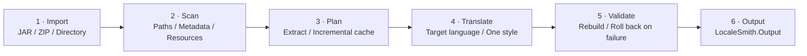

<!-- markdownlint-disable MD013 MD033 MD041 -->

<div align="center">
  

  <h1>LocaleSmith | 译匠</h1>

  <p><a href="./README.md">简体中文</a> · <strong>English</strong></p>

  <p><strong>A native Windows AI localization workbench for Minecraft: Java Edition content</strong></p>
  <p>Safely scan mods and resource packs, connect to local or cloud models, and generate localized artifacts through a verifiable, rollback-capable pipeline.</p>

  <p>
    <a href="./LICENSE"></a>
    <a href="./global.json"></a>
    <a href="./rust-toolchain.toml"></a>
    
    
    <a href="https://apps.microsoft.com/detail/9NP8V6WQNGT0"></a>
  </p>

  <p>
    
    
    
    
    
  </p>

  <p>
    <a href="https://apps.microsoft.com/detail/9NP8V6WQNGT0"><strong>Get it free from Microsoft Store</strong></a>
    ·
    <a href="https://github.com/DZXH-TX/LocaleSmith/releases/tag/v1.1.0">GitHub Release v1.1.0</a>
  </p>

  <p>
    <a href="#quick-start">Quick Start</a> ·
    <a href="#core-capabilities">Core Capabilities</a> ·
    <a href="#supported-scope">Supported Scope</a> ·
    <a href="#processing-pipeline">Processing Pipeline</a> ·
    <a href="#logs-and-data-persistence">Logs &amp; Data</a> ·
    <a href="#build-from-source">Build from Source</a> ·
    <a href="#security-boundaries">Security Boundaries</a> ·
    <a href="#contributing">Contributing</a>
  </p>
</div>

## Thirty-second overview

| Focus | Actual behavior |
| --- | --- |
| **Scan before modifying** | The native Rust core parses JAR / ZIP paths, Loader metadata, signature evidence, and language resources; original inputs remain read-only. |
| **Translate only new content** | Content hashes reuse translations while EntryIds, placeholders, and structure are validated; failure/cancellation never commits a partial artifact. |
| **Beyond lang files** | Handles resource/shader language files and structurally proven `Component.literal` externalization; unsafe candidates are reported or skipped. |
| **Choice with control** | Ollama, OpenAI-compatible, and Anthropic; explicit model refresh and Token/batch budgets, with private reasoning replayed only inside the same provider protocol loop. |
| **Credential and execution boundaries** | API keys stay in Credential Manager and configuration uses AES-256-GCM; models can propose commands, but policy and explicit user confirmation still gate execution. |

## Quick Start

### Install

> [!IMPORTANT]
> **Microsoft Store is the recommended installation channel.** It handles framework dependencies and future updates automatically.

<table>
<tr>
<th width="180">Channel</th>
<th>Description</th>
</tr>
<tr>
<td><a href="https://apps.microsoft.com/detail/9NP8V6WQNGT0"><b>Microsoft Store</b></a><br /><sub>Recommended</sub></td>
<td>Free download with automatic dependency installation and updates. Product ID <code>9NP8V6WQNGT0</code></td>
</tr>
<tr>
<td><a href="https://github.com/DZXH-TX/LocaleSmith/releases/tag/v1.1.0"><b>GitHub Release v1.1.0</b></a></td>
<td>Microsoft Marketplace-signed <code>CRTech.LocaleSmith_1.1.0.0_x64.Msix</code>; <b>no development test certificate required</b></td>
</tr>
</table>

<sub>MSIX checksum (SHA-256): <code>A2F24B73D4B20C9255DE32F3A6949251067ADFC53A24A4732C50B96FBBA84F64</code>　·　System requirements: Windows 10 1809 (build 17763) or later, x64</sub>

### Three steps

```text
1. Add packages       →  Select a JAR / ZIP or one extracted directory; multi-archive folders use Add package multi-select
2. Configure a model  →  Choose local Ollama or a cloud preset; only cloud services require their API key
3. Start translation  →  Choose the target language and one style, then queue; output goes to the current Workspace's LocaleSmith.Output
```

> [!NOTE]
> The standalone stdio MCP Host `CRTech.LocaleSmith.McpHost` is published at `0.1.1` and exposes only `system.context` and `cli.propose`. See the [package README](./.github/package-readmes/LocaleSmith.McpHost.md) for installation, GitHub Packages authentication, and client configuration.

## Project Overview

**LocaleSmith | 译匠** is designed for Minecraft: Java Edition mods, resource packs, and shader packs, integrating **secure scanning, incremental translation, structural validation, and transactional rebuilding** into a native Windows desktop workbench.

The project combines a native Rust scanning core with a .NET 10 / WinUI 3 desktop application. Rust handles parsing for JARs, ZIPs, Loader metadata, and supported bytecode patterns, while .NET handles archive transactions, model integration, secure storage, translation queues, and the user interface.

## Core Capabilities

<details open>
<summary><b>Translation and pipeline</b></summary>

<br />

| Capability | Description |
| --- | --- |
| **Secure archive scanning** | Detects path traversal, Loader metadata, language resources, signature evidence, and supported Java string references |
| **Incremental translation pipeline** | Reuses translations by content hash, validates placeholders and structure, and rolls back the entire job on failure |
| **Specialized prompts and terminology** | Distinguishes mods, resource packs, and shader packs and applies dedicated domain prompts; Simplified Chinese jobs include specialized terminology |
| **Multiple target languages** | Simplified Chinese, English, Japanese, French, and Russian; the centrally defined catalog can be extended |
| **Mod project synchronization** | Treats one normalized source artifact as a process-local project and synchronizes its objective, progress, status, and artifacts with the assistant |

</details>

<details open>
<summary><b>Model integration</b></summary>

<br />

| Capability | Description |
| --- | --- |
| **Three protocols** | Ollama · OpenAI-compatible Chat Completions · Anthropic Messages |
| **Provider presets** | DeepSeek, Qwen, Xiaomi MiMo, MiniMax, OpenAI, Doubao, Zhipu GLM, and Kimi fill endpoint, model name, and recommended Token parameters |
| **Model catalog refresh** | Ollama and OpenAI-compatible services exposing `/models` support explicit refresh with manual fallback |
| **Budgets and private reasoning** | Each source sets response Tokens and a translation batch target; providers needing continuity replay private state only within the same protocol loop |
| **Real usage** | Shows only Provider-reported Token usage; completed calls survive failure/cancellation, while missing or partial values are clearly marked and **never estimated** |

</details>

<details>
<summary><b>Desktop experience and operations</b></summary>

<br />

| Capability | Description |
| --- | --- |
| **Native desktop experience** | First-run onboarding, processing queue, model assistant, model-source management, logs, settings, and CLI risk confirmation |
| **Persistent diagnostic logs** | When the directory is writable and the writer has capacity, translation attempts to persist Debug / All levels `.log` pairs; the Logs page and directory setting remain available |
| **Credential and configuration protection** | API keys stay in Windows Credential Manager; other configuration uses AES-256-GCM |
| **Controlled MCP / CLI** | The assistant gets bounded project tools only with an active project; command execution requires policy revalidation and explicit user confirmation |
| **Online mod community** | Browse public mods and discussions; use a Credential Manager PAT for posts, replies, and reports |
| **Microsoft subscription and safe acceleration** | Native Store purchase UI, authoritative backend entitlement, and one-time download grants, with safe fallback to the default source |

</details>

## Supported Scope

<table>
<tr><th width="140">Category</th><th>Current support</th></tr>
<tr><td><b>Input</b></td><td>JAR, ZIP, or one extracted mod / resource-pack / shader-pack directory<br /><sub>Container folders with multiple JAR/ZIP files require Add package multi-select</sub></td></tr>
<tr><td><b>Loader metadata</b></td><td>Fabric · Forge · NeoForge · Quilt · Legacy Forge</td></tr>
<tr><td><b>Text resources</b></td><td>Minecraft language JSON · Legacy <code>.lang</code> · shader-pack <code>shaders/lang/*.lang</code> · <code>pack.txt</code> · supported display text in <code>pack.mcmeta</code></td></tr>
<tr><td><b>Bytecode</b></td><td>Structurally proven <code>Component.literal(String)</code> patterns<br /><sub>Other candidates are reported but not rewritten</sub></td></tr>
<tr><td><b>Model APIs</b></td><td>Ollama · OpenAI-compatible Chat Completions · Anthropic Messages</td></tr>
<tr><td><b>Model presets</b></td><td>DeepSeek · Qwen · Xiaomi MiMo · MiniMax · OpenAI · Doubao · Zhipu GLM · Kimi · custom endpoint</td></tr>
<tr><td><b>Target languages</b></td><td><code>zh_CN</code> · <code>en_US</code> · <code>ja_JP</code> · <code>fr_FR</code> · <code>ru_RU</code></td></tr>
<tr><td><b>Output</b></td><td>One target language + one translation style per job; package resources use lowercase locales such as <code>ja_jp</code></td></tr>
<tr><td><b>Platform</b></td><td>Windows x64, minimum Windows 10 1809</td></tr>
</table>

## Known Limitations

| Limitation | Current boundary |
| --- | --- |
| Quest/script formats | FTB Quests `.snbt`, Better Questing, KubeJS, and CraftTweaker `.zs` are outside the current translation scope. |
| Modpack containers | `.mrpack` and similar modpack formats are not processed as one input; use multi-select Add package for folders containing several JAR/ZIP files. |
| Project persistence | Mod projects, tasks, and project-scoped assistant sessions live only for the current process and are not restored after restart. |
| One output per job | A job freezes one target language and one style; enqueue separate jobs for other languages or styles. |
| Archive recompression | ZIP streams, extra fields, entry order/comments, and original signatures are not guaranteed byte-for-byte identical. |
| Bytecode subset | This is not a general Java rewriter; candidates that exceed narrow `ldc` capacity are safely skipped rather than receiving incomplete control-flow/StackMap rewrites. |
| Runtime matrix | Automated validation is not real in-game certification across Minecraft and Loader versions; test the intended target matrix. |
| Platform | Current deliverables are Windows x64 only, with no Linux, macOS, or ARM64 build. |

## Processing Pipeline

Every translation job follows the same transactional pipeline. The source remains read-only, and only a fully validated result is written to `LocaleSmith.Output`.



<details open>
<summary><strong>Job rules</strong></summary>

| Rule | Actual behavior |
| --- | --- |
| **Configuration snapshot** | Queueing a job freezes its target language, model source, translation style, response Token budget, and source-character batch target. |
| **Batching and ceiling** | The character target controls batching for large packages without truncating a single value; HTTP responses remain protected by a fixed, non-configurable 16 MiB limit. |
| **Source-locale selection** | LocaleSmith prefers `en_us`, `en_gb`, or another existing locale that differs from the target; for example, a Japanese-only package can provide the source for a generated `en_us`. |
| **Styles and caching** | Each job processes one style. Other styles are queued separately and can reuse the corresponding translation for the same source-text hash. |

</details>

<details>
<summary><strong>Projects, assistant sessions, and usage</strong></summary>

| Topic | Isolation and display rules |
| --- | --- |
| **Mod projects** | The Dashboard registers or reuses a process-local project by normalized source path and synchronizes the active project and its translation tasks with the assistant. The workspace is memory-only and is not restored after restart. |
| **Assistant sessions** | Every `ProjectId + ModelSourceId` pair has its own conversation and draft. Switching projects or model sources never mixes histories or sends one provider's history to another. |
| **Processing view** | Only deterministic model-round events, tool states, and the final run state are shown. Message content, tool arguments or results, paths, commands, exception text, and private `reasoning_content` are excluded. |
| **Token usage** | Only provider-reported usage is aggregated. A total appears only when the provider reports it or supplies both input and output counts. Usage from completed rounds survives later failure or cancellation; an in-flight call without usage is marked partial or unavailable, never estimated from characters. |

</details>

## Microsoft Store Subscription and Domestic Acceleration

LocaleSmith itself is free. Domestic download acceleration is a separate, optional monthly Microsoft Store subscription.

> [!WARNING]
> **Production acceleration is not enabled.** Local automation covers refusal paths, the purchase state machine, expiry / cancellation / refund / trial end, cross-device restore, four-way Range transfers, re-signing and resume, SHA-256, and default-source fallback.
>
> Live validation is still required for the Partner Center product and real purchase / renewal / refund flows, Microsoft recurrence / service tickets, PostgreSQL / Redis entitlement integration, and private RainS3 E2E.

<details>
<summary><strong>Pricing, trial, and management</strong></summary>

| Item | Current configuration |
| --- | --- |
| Billing | Microsoft (Partner Center) |
| Period | Monthly auto-renewal |
| Trial | Seven days for eligible new subscribers |
| Global base tier | US$4.99/month, localized by the Store |
| China market | CNY 30.00/month |
| Manage or cancel | [Microsoft Services & subscriptions](https://account.microsoft.com/services) |

- The client uses `Windows.Services.Store.StoreContext` for the purchase UI and **shows only the actual renewal price returned for the current region**.
- The table reflects the current Partner Center configuration, not a price promise hard-coded into the client.
- Microsoft Store does not support a native “CNY 24 first month, then CNY 30” introductory price, and LocaleSmith does not simulate one.

[View the privacy policy](https://dow.dzxh-tx.cn/privacy)

</details>

<details>
<summary><strong>Entitlement verification and download path</strong></summary>

Purchase, restore, and refresh require an existing LocaleSmith / MCTX account and a PAT with the `downloads:accelerated` scope. `Succeeded` and `AlreadyPurchased` **never unlock acceleration locally**; they only start backend verification:

```text
service-ticket → Store ID key → backend verify → entitlements
```

Only an exact, usable `domestic_download_acceleration` backend entitlement can proceed. Missing `microsoft_store_billing_v1` / `accelerated_downloads_v1`, PAT, scope, entitlement, or fresh backend verification always fails closed.

| Stage | Security behavior |
| --- | --- |
| **Source discovery** | Accepts only the relative default source and `additional_source` decision returned by the API. |
| **Secret isolation** | One-time GET / HEAD URLs never enter disk, logs, configuration, diagnostics, the clipboard, toasts, telemetry, or resume sidecars. Storage requests carry no PAT, Cookie, Authorization, Referer, or proxy credentials and never follow redirects. |
| **Resume and verification** | Uses a strong ETag, up to four Range requests, and `If-Range`; grant expiry triggers full backend re-authorization and re-signing, followed by final API size and SHA-256 checks. |
| **Safe fallback** | Any authorization, storage, or integrity failure falls back to the existing same-origin downloader. |

</details>

## Logs and Data Persistence

> [!NOTE]
> Logging is a **best-effort** background diagnostic channel, not part of the translation transaction. A slow disk, unwritable directory, or full writer queue can make logs incomplete, but never blocks translation.

### Viewing and retention

| Item | Behavior |
| --- | --- |
| **Logs page** | Lists records by translation job. Debug is the default view; switch to All levels for every log level, including fine-grained progress. |
| **Log files** | When conditions allow, each job creates a `.debug.log` / `.all.log` pair and incrementally flushes it to disk. Content flushed before an abnormal exit remains useful for locating the final recorded stage. |
| **Retention** | Retains and lists the latest 500 sessions. Cleanup matches only LocaleSmith's own naming format and never deletes unrelated files from the directory. |
| **Privacy** | Records only task ID, package file name, stage, progress, result, and error type. API keys, full prompts, and the parent directory of a selected path are excluded; common Bearer / Token / API Key patterns are redacted again before disk writes. |

<details>
<summary><strong>Directories, settings, and process-local data</strong></summary>

#### Default directories

| Runtime | Logical default directory |
| --- | --- |
| **Microsoft Store** | `%LOCALAPPDATA%\LocaleSmith\logs\translations` |
| **Unpackaged / Dev** | `%LOCALAPPDATA%\LocaleSmith.Dev\logs\translations` |

Windows may physically map registered MSIX data under each package family's `LocalCache\Local`; production and development packages remain isolated.

#### What persists

| Data | Persistence behavior |
| --- | --- |
| **Log directory** | Can be browsed or changed to another local directory during first-run onboarding or from Settings; a saved change applies to the next translation. |
| **Language, theme, workspace, and other settings** | The last valid values are written to encrypted configuration when the application closes. |
| **Configuration, credentials, Sandbox, and security locks** | Production and Unpackaged / Dev builds use isolated storage spaces. |
| **Mod projects, tasks, and assistant sessions** | Remain process-local and in memory only; they are not restored after the application restarts. |

</details>

## Build from Source

### Development prerequisites

| Dependency | Version or Notes |
| --- | --- |
| Operating system | Windows 10 1809 or later; Windows 11 is recommended for WinUI development |
| .NET SDK | `10.0.302`, pinned by `global.json` |
| Rust | Repository toolchain `1.97.1` (MSVC), including `rustfmt` and `clippy` |
| Windows SDK | `10.0.26100`, with MSVC / C++ build tools installed |
| UI dependencies | Windows App SDK `2.3.1` and CommunityToolkit.Mvvm `8.4.2` are restored through NuGet; running the unpackaged WinUI app also requires Windows App Runtime `2.3.1` to be registered |
| MSIX build | Requires Visual Studio Developer PowerShell with Desktop Bridge / WAP targets |

### Build

Build the Rust release DLL first, then restore and build the .NET solution:

```powershell
git clone https://github.com/DZXH-TX/LocaleSmith.git
Set-Location LocaleSmith

cargo build --manifest-path native/localesmith_core/Cargo.toml --locked --release
dotnet restore LocaleSmith.slnx
dotnet build LocaleSmith.slnx -c Release
```

> [!NOTE]
> `dotnet build LocaleSmith.slnx` does not generate the WAP / MSIX package. The packaging project is located at `packaging/LocaleSmith.Package` and must be built separately in a development environment with the corresponding Visual Studio targets.

<details>
<summary><strong>Run the full validation gate</strong></summary>

```powershell
cargo fmt --manifest-path native/localesmith_core/Cargo.toml --all -- --check
cargo clippy --manifest-path native/localesmith_core/Cargo.toml --locked --all-targets --all-features -- -D warnings
cargo test --manifest-path native/localesmith_core/Cargo.toml --locked --all-targets

dotnet test LocaleSmith.slnx -c Release
dotnet format LocaleSmith.slnx --verify-no-changes --no-restore
```

</details>

## Source Layout

```text
native/localesmith_core/       Rust ZIP/JAR, metadata, and classfile scanning core
src/LocaleSmith.Core/           Domain models and unified service contracts
src/LocaleSmith.NativeInterop/  C ABI projection, DLL resolution, and typed manifests
src/LocaleSmith.Application/    Translation orchestration, incremental planning, queues, and transaction boundaries
src/LocaleSmith.Archive/        Secure snapshots, extraction, rebuilding, validation, and rollback
src/LocaleSmith.Infrastructure/ Model adapters, credentials, encryption, CLI, and environment detection
src/LocaleSmith.Mcp/            MCP JSON-RPC / stdio protocol and tool catalog
src/LocaleSmith.McpHost/        Standalone MCP console host
src/LocaleSmith.Presentation/   Testable MVVM ViewModels and UI contracts
src/LocaleSmith.App/            WinUI 3 views, composition root, and local application services
tests/                      Eight .NET test projects and a restricted CLI probe
packaging/                  x64 WAP / MSIX manifest, five-language resources, and icons
```

## Security Boundaries

> [!IMPORTANT]
> The following boundaries are fixed product behavior, not options that can be disabled.

| Boundary | Fixed behavior |
| --- | --- |
| **Command authorization** | A model can only propose a command. The user must review the full command, acknowledge the risk, and explicitly approve execution. |
| **Signed archives** | The source JAR / ZIP remains read-only. The translation queue creates an explicit unsigned copy only in independent output and never impersonates the original signature or hashes. |
| **CLI discovery** | The process `PATH` is never searched and process executables are not trusted by default. Any allowlist must use an approved absolute path. The private sandbox is `%LOCALAPPDATA%\LocaleSmith\CliSandbox`, with reparse points checked before and after creation. |
| **Cloudflare origin identity** | The client uses the system trust store for ordinary server TLS on `api.dzxh-tx.cn`. Authenticated Origin Pulls authenticates only Cloudflare to the origin; its certificate and private key must never enter the application, MSIX, or repository. |
| **Store and download secrets** | PATs, Entra service tickets, Store ID keys, and pre-signed GET / HEAD URLs never enter logs, configuration, telemetry, diagnostics, or persistent resume metadata. The client contains no Entra client secret, and storage requests carry no MCTX Authorization / Cookie. |
| **Low IL capability boundary** | A restricted token, private desktop, and Job Object reduce the execution surface. They do not automatically block networking or prevent reads allowed by the current user's ACLs. |

<details>
<summary><strong>Exact scope of bytecode externalization</strong></summary>

- **Match scope:** only structurally proven, immediately adjacent `ldc` / `ldc_w` strings and Mojang `Component.literal(String):MutableComponent` static calls are converted into exact `translatable(String)` references.
- **Commit validation:** instruction length is preserved and the result is rescanned before commit.
- **Skip policy:** branch or exception boundaries, unknown opcodes, obfuscated code, and every inexact pattern are left unchanged.
- **Capability boundary:** this is not a general-purpose Java bytecode rewriter and does not claim coverage of a real-world Minecraft / Loader compatibility matrix.

</details>

<details>
<summary><strong>Archive rebuilding and signatures</strong></summary>

- **Read-only source:** every change occurs only in a transactional working copy and independent output.
- **Signature handling:** the translation queue removes signature blocks, `SIG-*`, and stale manifest digest claims only from independent output; low-level callers may still choose complete blocking.
- **Atomic commit:** JSON / lang / manifest content, Java classes, Loader metadata, services, and resource references must all validate before commit. Failures never publish a partial artifact.
- **Recompression differences:** byte-for-byte preservation of ZIP / JAR streams, extra fields, comments, ordering, or Loader behavior is not guaranteed.
- **Build claims:** a precompiled JAR reports only static bytecode and resource validation, never “source compilation passed.” Inputs with source and a Gradle / build entry fail closed because no genuinely isolated build executor exists, and archive scripts are never launched directly.

</details>

<details>
<summary><strong>Model tool and CLI isolation</strong></summary>

| Area | Boundary |
| --- | --- |
| **Base tools** | The in-app assistant always retains `system.context` and `cli.propose`. |
| **Read-only project tools** | Selecting an active project adds `project.get_active`, `archive.inspect`, and `task.status`. |
| **Project mutation tools** | `translation.start` / `task.cancel` are exposed only after the user grants one-turn permission for the current message to change the project. |
| **Project binding** | Every project tool is bound to the `ProjectId` captured for that turn, accepts only opaque project / task IDs, and never accepts arbitrary host paths. `translation.start` is forced to use the selected model source and reuses the inspect, safe-extract, translate, repack, verify, and commit transaction pipeline. |
| **Standalone MCP Host** | It has no App project backend, so its stdio catalog contains only `system.context` and `cli.propose`. |
| **CLI execution** | No entry point exposes `cli.execute`; commands still require policy revalidation, a one-time confirmation token, and explicit user approval. |
| **Private reasoning** | Kimi `reasoning_content` is replayed within bounds only in the same Kimi tool loop. It never enters the activity timeline or user-visible content and is never sent to another provider. |

</details>

<details>
<summary><strong>MSIX package status</strong></summary>

| Status | Details |
| --- | --- |
| **Public release** | `v1.1.0`; Store package `1.1.0.0`, product ID `9NP8V6WQNGT0`, identity `CRTech.LocaleSmith`. Microsoft Store provides distribution and automatic updates. |
| **Signature and capability** | The GitHub Release x64 MSIX has passed Marketplace signature-chain, trusted-timestamp, identity, architecture, and SHA-256 verification and needs no historical self-signed test certificate. The package declares `runFullTrust`; model-proposed commands still require policy revalidation and user approval. |
| **Next package source** | The source prepares `1.2.0.0`, which is not yet a public release. WAP defaults to an unsigned, isolated `CRTech.LocaleSmith.Dev` validation package; only explicit `PackageFlavor=Store` produces an unsigned submission candidate with the production identity. Both require unpacking, PRI, version, and full payload-hash audits. An unsigned package is not a Store release. |
| **Legacy development package migration** | The production identity cannot update `LocaleSmith.Desktop` / `JaxI18n.Desktop` in place, so Windows temporarily installs them side by side. Close the older app during transition; the new app continues to use `%LOCALAPPDATA%\LocaleSmith` and read-only discovers redirected data from still-registered legacy packages. Uninstall a legacy package only after confirming the production-identity build works. |

</details>

## Validation Snapshot

The following figures are the validation baseline recorded in the current source, not live CI status:

| Check | Baseline |
| --- | --- |
| .NET Release | `855 / 855` tests, `0` warnings, `0` errors |
| Rust | `28 / 28` tests; `rustfmt` and `clippy -D warnings` passed |
| Five-language resources | `676` keys each for `zh-CN` / `en-US` / `ja-JP` / `fr-FR` / `ru-RU`, fully aligned |
| Source security audit | Regression gates for local paths, archives, CLI, credentials, and migrations passed; GitHub CodeQL results depend on a fresh remote scan of the current commit, and the README does not claim zero alerts |

These results demonstrate the source behavior covered by the current automation. They do not replace external penetration testing, real provider validation, or Minecraft / Loader runtime compatibility testing.

## Contributing

Pull requests are welcome. Before submitting:

- [ ] Run the Rust / .NET validation gates relevant to the change
- [ ] State the target Minecraft version and Loader
- [ ] State the input type (JAR / ZIP / directory) and model source
- [ ] Disclose AI assistance that materially affected the project

See also: [Code of Conduct](./.github/CODE_OF_CONDUCT.md) · [Contributing Guide](./.github/CONTRIBUTING.md) · [Security Policy](./.github/SECURITY.md)

## License

This project is open source under the [Apache License 2.0](./LICENSE).

<details>
<summary><b>Artificial Intelligence Use Statement</b></summary>

<br />

This project permits the use of generative artificial intelligence tools for requirements analysis, code and documentation drafting, refactoring suggestions, test design, localization, and similar activities. All AI-assisted output must undergo human review, necessary testing, and security and license verification before submission. Maintainers and contributors remain fully responsible for the correctness, security, compliance, and maintainability of their submissions; AI output does not constitute a factual, legal, or professional guarantee.

When using AI tools, do not upload secrets, credentials, personal information, unpublished source code, or restricted third-party content to unauthorized external services, and comply with the applicable terms of service and third-party licenses. Contributors should accurately disclose AI-assisted content with a material impact on the project in their pull requests. This statement does not alter the licensing, copyright, or contribution ownership established under the Apache License 2.0.

</details>

<br />

<div align="center">

Copyright © 2026 **DZXH-TX（道泽星河-天仙）**

<sub>Copyright holder and licensor</sub>

<br />

[Project home](https://github.com/DZXH-TX/LocaleSmith) · [Issues](https://github.com/DZXH-TX/LocaleSmith/issues) · [Discussions](https://github.com/DZXH-TX/LocaleSmith/discussions)

</div>
