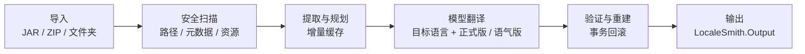

<!-- markdownlint-disable MD013 MD033 MD041 -->

<div align="center">
  

  <h1>LocaleSmith | 译匠</h1>

  <p><strong>简体中文</strong> · <a href="./README.en.md">English</a></p>

  <p><strong>为 Minecraft: Java Edition 内容打造的 Windows 原生 AI 本地化工作台</strong></p>
  <p>安全扫描模组与资源包，连接本地或云端模型，以可验证、可回滚的流水线生成本地化产物。</p>

  <p>
    <a href="./LICENSE"></a>
    <a href="./global.json"></a>
    <a href="./rust-toolchain.toml"></a>
    
    
    <a href="https://apps.microsoft.com/detail/9NP8V6WQNGT0"></a>
  </p>

  <p>
    
    
    
    
    
  </p>

  <p>
    <a href="https://apps.microsoft.com/detail/9NP8V6WQNGT0"><strong>从 Microsoft Store 免费获取</strong></a>
    ·
    <a href="https://github.com/DZXH-TX/LocaleSmith/releases/tag/v1.1.0">GitHub Release v1.1.0</a>
  </p>

  <p>
    <a href="#项目概览">项目概览</a> ·
    <a href="#核心能力">核心能力</a> ·
    <a href="#支持范围">支持范围</a> ·
    <a href="#处理流程">处理流程</a> ·
    <a href="#快速开始">快速开始</a> ·
    <a href="#安全边界">安全边界</a> ·
    <a href="#参与贡献">参与贡献</a>
  </p>
</div>

> [!IMPORTANT]
> **LocaleSmith v1.1.0 已在 [Microsoft Store](https://apps.microsoft.com/detail/9NP8V6WQNGT0) 正式上架。** 推荐通过商店安装，以自动处理依赖和后续更新；[GitHub Release](https://github.com/DZXH-TX/LocaleSmith/releases/tag/v1.1.0) 同时提供经 Microsoft Marketplace 签名的正式 MSIX，无需安装开发测试证书。

## 项目概览

**LocaleSmith | 译匠**，面向 Minecraft: Java Edition 模组、资源包与光影包，将**安全扫描、增量翻译、结构验证和事务重建**整合进一个 Windows 原生桌面工作台。

项目采用 Rust 原生扫描核心与 .NET 10 / WinUI 3 桌面应用：Rust 负责 JAR、ZIP、Loader 元数据和受支持字节码模式的解析，.NET 负责归档事务、模型接入、安全存储、翻译队列与用户界面。

## 核心能力

| 能力 | 说明 |
| --- | --- |
| **安全归档扫描** | 识别路径穿越、Loader 元数据、语言资源、签名证据与受支持的 Java 字符串引用。 |
| **增量翻译流水线** | 按内容哈希复用译文，校验占位符与结构，并在失败时回滚整个作业。 |
| **模组项目同步** | Dashboard 将同一规范化源 artifact 作为一个进程内模组项目，向助手同步任务目标、进度、状态与产物；当前不会跨应用重启持久化项目。 |
| **专业提示与术语** | 自动区分模组、资源包与光影包，使用独立领域提示；简体中文任务附带各自的专业术语对照表。 |
| **多目标语言** | 首批支持简体中文、英语、日语、法语与俄语；语言目录集中定义，可继续扩展。 |
| **多模型接入** | 统一支持 Ollama、OpenAI-compatible Chat Completions 与 Anthropic Messages。 |
| **提供方预设** | DeepSeek、Qwen、Xiaomi MiMo、MiniMax、OpenAI、豆包、智谱 GLM 与 Kimi 等预设会同步填充服务地址和模型名，并选择推荐的补全 Token 参数；Ollama 与支持 `/models` 的 OpenAI-compatible 服务可显式刷新模型列表，始终保留手填回退。每个模型源还可设置单次响应 Tokens 与翻译分批字符目标；需要跨工具轮次连续思考的 Provider 会在协议层私下回放推理状态，不显示到 UI。 |
| **联机模组社区** | 可搜索和分页浏览公开模组与讨论；使用保存在 Windows Credential Manager 中的 PAT 发帖、回复和举报，并可直接查看服务条款与社区规范。 |
| **Microsoft 订阅与安全加速** | 使用 Windows 原生 Microsoft Store 购买界面、MCTX 后端权威权益核验与一次性下载 grant；加速不可用时始终保留并回退默认下载源。 |
| **持久化诊断日志** | 日志目录可写时，每次翻译都会尝试通过有界后台写入器持久化一对 Debug 与 All levels `.log`；可在左侧“日志”页查看并在引导或设置中修改目录。 |
| **原生桌面体验** | 提供首次引导、处理队列、模型助手、模型源管理、日志、设置和 CLI 风险确认。 |
| **模型活动与真实用量** | 助手显示由程序产生的模型轮次与工具活动，不展示私有推理；Provider 返回的 Token usage 会贯穿助手与翻译任务，失败/取消前已完成的调用也会保留，缺失或不完整时明确标记且绝不估算。 |
| **凭据与配置保护** | API Key 存入 Windows Credential Manager，其他配置使用 AES-256-GCM 加密。 |
| **受控 MCP / CLI** | App 内助手仅在有活动模组项目时增加受限项目工具；独立 stdio Host 仍只能读取安全上下文和提出命令，CLI 执行必须经过策略复核和用户明确确认。 |

## 支持范围

| 类别 | 当前支持 |
| --- | --- |
| 输入 | JAR、ZIP、展开后的单个模组/资源包/光影包目录；含多个 JAR/ZIP 的容器目录需通过“添加包”多选归档 |
| Loader 元数据 | Fabric、Forge、NeoForge、Quilt、Legacy Forge |
| 文本资源 | Minecraft 语言 JSON、Legacy `.lang`、光影包 `shaders/lang/*.lang`、`pack.txt`、受支持的 `pack.mcmeta` 显示文本 |
| 字节码 | 经结构证明的 `Component.literal(String)` 精确模式；其他候选仅报告、不改写 |
| 模型接口 | Ollama、OpenAI-compatible Chat Completions、Anthropic Messages |
| 模型预设 | DeepSeek、Qwen、Xiaomi MiMo、MiniMax、OpenAI、豆包、智谱 GLM、Kimi，以及自定义入口 |
| 目标语言 | `zh_CN`、`en_US`、`ja_JP`、`fr_FR`、`ru_RU` |
| 输出 | 当前作业选择的一种目标语言与一种翻译风格；包内资源名使用小写 Minecraft locale，如 `ja_jp` |
| 平台 | Windows x64，最低 Windows 10 1809 |

## 处理流程



每个作业会在入队时冻结用户选择的目标语言、模型源、一种翻译风格、单次响应 Token 预算和每批原文字符目标。字符目标只控制大型包分批，不截断单条文本；HTTP 响应体仍受不可关闭的固定 16 MiB 安全上限保护。语言资源优先使用非目标语言的 `en_us`、`en_gb` 或其他现有 locale 作为源文；例如目标为英语但包内只有日语时，会从日语生成 `en_us`。另一种风格可以单独入队，并复用相同原文哈希下已经缓存的对应译文。

Dashboard 添加源 artifact 时，会按规范化源路径在当前进程内注册或复用一个模组项目，并把活动项目及其翻译任务同步到助手。助手为每个 `ProjectId + ModelSourceId` 组合保存独立会话和草稿；切换项目或模型源只恢复对应会话，不会把一个模组的历史混入另一个模组，也不会把上一 Provider 的历史发送给新 Provider。项目工作区当前仅驻留内存，应用重启后不会恢复。

助手的“处理过程”只显示确定性的模型轮次开始/完成、工具开始/完成/失败与运行终态；事件不包含消息正文、工具参数/结果、路径、命令、异常文本或私有 `reasoning_content`。Provider 报告的 Token usage 会汇总到助手答复和翻译任务；任务失败或取消时，已完成 Provider 轮次的用量仍会保留，在途调用未返回 usage 时则标记为部分/不可用。只有 Provider 给出 total，或同时给出 input/output 时才显示可计算总数，不用字符数或其他启发式估算。

## Microsoft Store 订阅与国内加速

LocaleSmith 使用 `Windows.Services.Store.StoreContext` 读取隐藏的父应用内订阅、显示 Microsoft 购买界面，并通过主窗口 HWND 绑定桌面模态 UI。Partner Center 配置为月度自动续费、符合资格的新订阅用户 7 天免费试用、全球 US$4.99/月基础价格档位并由 Store 本地化、中国市场配置 CNY 30.00/月；客户端界面只显示 Store 为当前区域返回的实际续费价，不向中国用户硬编码展示美元基础档位。订阅由 Microsoft 计费，可在 [Microsoft 服务和订阅](https://account.microsoft.com/services) 中管理或取消；[隐私政策](https://dow.dzxh-tx.cn/privacy) 保持可发现。Microsoft Store 不支持“首月 CNY 24、以后 CNY 30”的原生 introductory price，客户端不会伪造该优惠。

购买、恢复与刷新都要求先用现有 LocaleSmith/MCTX 账号和含 `downloads:accelerated` scope 的 PAT 登录。`Succeeded` 或 `AlreadyPurchased` 只会启动 `service-ticket → Store ID key → backend verify → entitlements`，不会直接解锁；只有后端返回精确的 `domestic_download_acceleration` 有效权益才可进入下一步。缺少 `microsoft_store_billing_v1` / `accelerated_downloads_v1`、PAT、scope、有效权益或后端新鲜核验时，购买或加速入口失败关闭。

下载源发现只接受后端返回的相对默认源和 `additional_source` 判定；客户端不硬编码对象存储主机、bucket、对象 key 或长期 URL。一次性 GET/HEAD 签名 URL 只在内存和对应 HTTPS 请求中短暂存在，不进入日志、配置、诊断、剪贴板、toast、遥测或断点 sidecar；对象存储请求不携带 PAT、Cookie、Authorization、Referer 或代理凭据，也不跟随重定向。传输使用独立 HEAD 取得强 ETag，最多四路 Range + If-Range 下载，grant 过期时重新完成全套后端门控并续签，最终按 API 的 size 与 SHA-256 验证；任何授权、对象存储或完整性异常都会安全回退原有同源默认下载器。

本地自动化已覆盖 capability/PAT/scope/权益拒绝矩阵、购买状态机、过期/取消/退款/试用结束、跨设备恢复、账号暂停、核验陈旧、秘密请求正文、GET/HEAD 分离、精确 HTTPS origin、四路 Range、续签续传、无秘密断点元数据、SHA-256 与默认源回退。网站源码契约和 replica worker 已统一使用唯一权益 `domestic_download_acceleration`，但尚未验证真实 Partner Center 商品、购买/续费/退款/跨设备恢复、Microsoft recurrence/service ticket、真实 PostgreSQL/Redis 权益联调或 RainS3 私有桶 E2E，也未在本次工作中启用或部署生产加速。

## 翻译日志与持久化设置

左侧导航中的“日志”页按翻译作业列出持久化记录，并默认显示 Debug 视图；切换到 All levels 可查看包含细粒度进度在内的完整级别记录。日志是最大限度的后台诊断功能：目录正常可写且写入器有容量时，作业会创建一对 `.debug.log` / `.all.log` 文件并增量刷新到磁盘；慢设备或队列已满时可能跳过文件或丢弃部分诊断条目，但不会阻塞翻译。进程异常退出后，已经成功刷新的内容仍可用于定位最后一个阶段。

正式 Store 包的默认目录为 `%LOCALAPPDATA%\LocaleSmith\logs\translations`；unpackaged/Dev 包使用隔离的 `%LOCALAPPDATA%\LocaleSmith.Dev\logs\translations`，配置、凭据、Sandbox 与安全锁也不会和正式版混用。首次引导和“设置”页都可以浏览或手动修改为本地目录；更改保存后从下一次翻译起生效，并会在软件关闭时与语言、主题、工作区等最后一次有效设置一起写入加密配置。程序只保留并列出最新 500 次会话；清理仅匹配 LocaleSmith 自有命名格式，不删除目录内的其他文件。日志仅记录任务 ID、包文件名、阶段、进度、结果与错误类型，不写入 API Key、完整提示词或用户选择路径的父目录；常见 Bearer / Token / API Key 形式还会在写盘前再次脱敏。

## 快速开始

### 安装正式版

| 渠道 | 说明 |
| --- | --- |
| [Microsoft Store](https://apps.microsoft.com/detail/9NP8V6WQNGT0) | 推荐方式；免费获取并由商店处理安装、框架依赖与后续更新。产品 ID：`9NP8V6WQNGT0`。 |
| [GitHub Release v1.1.0](https://github.com/DZXH-TX/LocaleSmith/releases/tag/v1.1.0) | 提供 Microsoft Marketplace 签名的 `CRTech.LocaleSmith_1.1.0.0_x64.Msix`，适用于需要直接下载安装包的场景。 |

GitHub MSIX 的 SHA-256 为 `A2F24B73D4B20C9255DE32F3A6949251067ADFC53A24A4732C50B96FBBA84F64`。正式版支持 Windows x64，最低系统版本为 Windows 10 1809（Build 17763）。

独立 stdio MCP Host 以 .NET 工具包 `CRTech.LocaleSmith.McpHost` 维护；当前源码包版本为 `0.1.1`。它仍只暴露 `system.context` 与 `cli.propose`，不包含 App 专属项目/文件工具。安装、GitHub Packages 鉴权与客户端配置见[包 README](./.github/package-readmes/LocaleSmith.McpHost.md)。

### 开发环境要求

| 依赖 | 版本或说明 |
| --- | --- |
| 操作系统 | Windows 10 1809 或更高版本；WinUI 开发建议 Windows 11 |
| .NET SDK | `10.0.302`，由 `global.json` 固定 |
| Rust | 仓库工具链 `1.97.1`（MSVC），包含 `rustfmt` 与 `clippy` |
| Windows SDK | `10.0.26100`，并安装 MSVC / C++ 构建工具 |
| UI 依赖 | Windows App SDK `2.3.1`、CommunityToolkit.Mvvm `8.4.2`，由 NuGet 还原 |
| MSIX 构建 | 需要包含 Desktop Bridge / WAP targets 的 Visual Studio Developer PowerShell |

### 从源码构建

先生成 Rust release DLL，再还原并构建 .NET solution：

```powershell
git clone https://github.com/DZXH-TX/LocaleSmith.git
Set-Location LocaleSmith

cargo build --manifest-path native/localesmith_core/Cargo.toml --release
dotnet restore LocaleSmith.slnx
dotnet build LocaleSmith.slnx -c Release
```

> [!NOTE]
> `dotnet build LocaleSmith.slnx` 不会生成 WAP / MSIX；打包工程位于 `packaging/LocaleSmith.Package`，需要在具备对应 Visual Studio targets 的开发环境中单独构建。

<details>
<summary><strong>运行完整验证门</strong></summary>

```powershell
cargo fmt --manifest-path native/localesmith_core/Cargo.toml --all -- --check
cargo clippy --manifest-path native/localesmith_core/Cargo.toml --all-targets --all-features -- -D warnings
cargo test --manifest-path native/localesmith_core/Cargo.toml --all-targets

dotnet test LocaleSmith.slnx -c Release
dotnet format LocaleSmith.slnx --verify-no-changes --no-restore
```

</details>

## 源码结构

```text
native/localesmith_core/       Rust ZIP/JAR、metadata 与 classfile 扫描核心
src/LocaleSmith.Core/           领域模型和统一服务契约
src/LocaleSmith.NativeInterop/  C ABI 投影、DLL 解析与类型化清单
src/LocaleSmith.Application/    翻译编排、增量计划、队列与事务边界
src/LocaleSmith.Archive/        安全快照、提取、重建、验证与回滚
src/LocaleSmith.Infrastructure/ 模型适配、凭据、加密、CLI 与环境检测
src/LocaleSmith.Mcp/            MCP JSON-RPC / stdio 协议与工具目录
src/LocaleSmith.McpHost/        独立 MCP 控制台宿主
src/LocaleSmith.Presentation/   可测试的 MVVM ViewModel 与 UI 契约
src/LocaleSmith.App/            WinUI 3 视图、组合根和本地应用服务
tests/                      八个 .NET 测试项目和受限 CLI probe
packaging/                  x64 WAP / MSIX manifest、五语言资源和图标
```

## 安全边界

以下原则是产品行为的一部分，而不是可选配置：

- **模型不能授权命令执行。** Provider 工具循环可使用当前明确暴露的安全上下文、项目工具和命令提议工具，但完整命令仍需用户查看、勾选风险确认并批准。
- **签名 JAR 默认只生成明确的 unsigned 副本。** 原 JAR / ZIP 始终保持不动；应用翻译队列只在独立输出中移除签名块、`SIG-*` 与失效的 manifest 摘要声明，底层调用仍可选择完全阻断，且项目绝不冒充原签名或哈希。
- **CLI 不搜索进程 PATH。** 默认不信任任何进程型可执行文件；后续显式白名单必须使用已批准的绝对路径。私有 CLI 沙箱默认位于 `%LOCALAPPDATA%\LocaleSmith\CliSandbox`，并在创建前后检查重解析点。
- **客户端不携带 Cloudflare 源站密钥。** `api.dzxh-tx.cn` 使用系统信任库完成普通服务器 TLS 验证；Authenticated Origin Pulls 只认证 Cloudflare 到源站的连接，其证书和私钥不得进入应用、MSIX 或仓库。
- **Store 与下载 grant 都是秘密。** PAT、Entra service ticket、Microsoft Store ID key 和预签名 GET/HEAD URL 不写日志、配置、遥测、诊断包或持久化断点；客户端不含 Entra client secret，对象存储请求也绝不携带 MCTX Authorization/Cookie。
- **Low IL 不等于 AppContainer。** 受限 token、私有 desktop 与 Job Object 会缩小执行面，但不会自动阻断网络，也不能阻止读取当前用户 ACL 已允许的文件。

<details>
<summary><strong>字节码外部化的精确范围</strong></summary>

当前只改写经结构证明、紧邻出现的 `ldc` / `ldc_w` 字符串与 Mojang `Component.literal(String):MutableComponent` 静态调用，并转换为精确的 `translatable(String)` 引用。实现会保持指令长度，在提交前重新扫描验证；分支或异常边界、未知 opcode、混淆代码及任何不精确模式都不会被改写。这不是通用 Java 字节码重写器，也尚未覆盖真实 Minecraft / Loader 兼容矩阵。

</details>

<details>
<summary><strong>归档重建与签名</strong></summary>

原输入始终保持不动，所有结构和行为调整只发生在事务工作副本与独立输出中；逐项验证 JSON / lang / manifest、Java class、Loader、服务及资源引用后才会原子提交，失败不会发布半成品。不过 ZIP / JAR 会被重新压缩，因此不保证压缩流、extra field、条目注释、顺序或 Loader 行为兼容性在字节级完全一致。预编译 JAR 只报告静态字节码与资源验证，绝不声称“源码编译通过”；若输入含源码和 Gradle / build 入口，当前因没有真正隔离的构建器而失败关闭，且不会直接执行归档内脚本。

</details>

<details>
<summary><strong>模型工具与 CLI 隔离</strong></summary>

App 内助手始终保留 `system.context` 与 `cli.propose`；选中活动模组项目后会增加 `project.get_active`、`archive.inspect` 与 `task.status`，而 `translation.start` / `task.cancel` 只有在用户勾选“允许此条消息更改项目”的一次性授权后才会暴露。所有项目工具都绑定本轮捕获的 `ProjectId`，只接受项目/任务的不透明 ID，不接受任意主机路径；`translation.start` 还会强制使用本轮助手所选模型源，并复用真实的检查、安全解包、翻译、重打包、验证与提交事务流水线。独立 `LocaleSmith.McpHost` 没有 App project backend，因此其 stdio 目录仍只有 `system.context` 与 `cli.propose`。任何入口都不暴露 `cli.execute`；允许执行的命令仍需策略复核、一次性确认 token 与用户明确批准。Kimi 的私有 `reasoning_content` 仅在同一 Kimi 工具循环内有界回放，不进入活动时间线或用户可见内容，也不会发送给其他 Provider。

</details>

<details>
<summary><strong>MSIX 程序包状态</strong></summary>

当前公开正式版本为 `v1.1.0`，Store 程序包版本为 `1.1.0.0`，产品 ID 为 `9NP8V6WQNGT0`，并使用 Partner Center 分配的 Identity `CRTech.LocaleSmith`。Microsoft Store 负责正式分发和自动更新；GitHub Release 中的 x64 MSIX 已通过 Microsoft Marketplace 签名链、可信时间戳、程序包 Identity、架构与 SHA-256 校验，不需要历史开发包使用的自签名测试证书。公开程序包声明 `runFullTrust` 桌面功能，模型提出的命令仍必须经过策略复核与用户明确确认。

当前源码准备下一版 `1.2.0.0`，但尚未作为正式版发布。WAP 默认生成隔离的未签名 `CRTech.LocaleSmith.Dev` 验证包；只有显式 `PackageFlavor=Store` 才生成正式 Identity 的未签名提交候选。两种包都必须通过解包、PRI、版本和全 payload 哈希审计，未签名包不等同于 Store 发布件。

正式 Identity `CRTech.LocaleSmith` 不会原位升级早期的 `LocaleSmith.Desktop` / `JaxI18n.Desktop` 开发包，Windows 会暂时并列安装。切换时请关闭旧程序；新程序会继续使用用户级 `%LOCALAPPDATA%\LocaleSmith`，并只读检查仍已注册的旧包重定向数据。确认新版本工作正常后再卸载旧开发包。

</details>

## 验证快照

以下数字是当前源码记录的验证基线，不是实时 CI 状态：

| 检查项 | 基线 |
| --- | --- |
| .NET Release | `854 / 854` tests，`0` warnings，`0` errors |
| Rust | `28 / 28` tests，`rustfmt` 与 `clippy -D warnings` 通过 |
| 五语言资源 | `zh-CN` / `en-US` / `ja-JP` / `fr-FR` / `ru-RU` 各 `676` 个 key，完全对齐 |
| 源码安全审计 | 本地路径、归档、CLI、凭据和迁移回归门通过；GitHub CodeQL 结果以当前提交的远端重扫为准，不在 README 中宣称零告警 |

这些结果证明当前自动化覆盖的源码行为，不替代外部渗透测试、真实 Provider 验证或 Minecraft / Loader 运行时兼容测试。

## 参与贡献

欢迎提交 Pull Request。提交代码前，请至少运行与改动相关的 Rust / .NET 验证门，并清楚说明目标 Minecraft 版本、Loader、输入类型和模型来源。

## 开源许可

本项目依据 [Apache License 2.0](./LICENSE) 开源。

## 人工智能使用声明

本项目允许在需求分析、代码与文档草拟、重构建议、测试设计和本地化等环节使用生成式人工智能工具。所有 AI 辅助产出必须经过人工审阅、必要测试以及安全与许可核验后方可提交；维护者和贡献者仍对其提交内容的正确性、安全性、合规性和可维护性承担完整责任，AI 输出不构成事实、法律或专业保证。

使用 AI 工具时，不得向未经授权的外部服务上传密钥、凭据、个人信息、未公开源码或受限制的第三方内容，并应遵守相应服务条款与第三方许可证。对项目有实质影响的 AI 辅助内容，贡献者应在 Pull Request 中如实说明；本声明不改变 Apache License 2.0 下的许可、版权与贡献归属。

Copyright © 2026 **DZXH-TX（道泽星河-天仙）**（版权所有者与许可人）。
