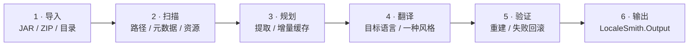

<!-- markdownlint-disable MD013 MD033 MD041 -->

<div align="center">
  

  <h1>LocaleSmith | 译匠</h1>

  <p><strong>简体中文</strong> · <a href="./README.en.md">English</a></p>

  <p><strong>为 Minecraft: Java Edition 内容打造的 Windows 原生 AI 本地化工作台</strong></p>
  <p>安全扫描模组与资源包，连接本地或云端模型，以可验证、可回滚的流水线生成本地化产物。</p>

  <p>
    <a href="./LICENSE"></a>
    <a href="./global.json"></a>
    <a href="./rust-toolchain.toml"></a>
    
    
    <a href="https://apps.microsoft.com/detail/9NP8V6WQNGT0"></a>
  </p>

  <p>
    
    
    
    
    
  </p>

  <p>
    <a href="https://apps.microsoft.com/detail/9NP8V6WQNGT0"><strong>从 Microsoft Store 免费获取</strong></a>
    ·
    <a href="https://github.com/DZXH-TX/LocaleSmith/releases/tag/v1.1.0">GitHub Release v1.1.0</a>
  </p>

  <p>
    <a href="#快速开始">快速开始</a> ·
    <a href="#核心能力">核心能力</a> ·
    <a href="#支持范围">支持范围</a> ·
    <a href="#处理流程">处理流程</a> ·
    <a href="#日志与数据持久化">日志与数据</a> ·
    <a href="#从源码构建">从源码构建</a> ·
    <a href="#安全边界">安全边界</a> ·
    <a href="#参与贡献">参与贡献</a>
  </p>
</div>

## 三十秒了解

| 重点 | 实际行为 |
| --- | --- |
| **先扫描，再改包** | Rust 原生核心解析 JAR / ZIP / Loader 元数据、路径、签名证据与语言资源；原始输入始终只读。 |
| **只翻新增内容** | 按内容哈希复用译文，逐项校验 EntryId、占位符和结构；失败/取消不提交半成品。 |
| **不仅是 lang 文件** | 支持资源包、光影包语言文件与经结构证明的 `Component.literal` 精确外部化；不安全候选只报告或跳过。 |
| **模型可选且可控** | Ollama、OpenAI-compatible、Anthropic；显式刷新模型列表、设置 Token/分批预算，私有推理只在同源协议轮次回放。 |
| **凭据和执行有边界** | API Key 在 Credential Manager，配置 AES-256-GCM；模型只能提议命令，执行仍需策略复核和用户确认。 |

## 快速开始

### 安装

> [!IMPORTANT]
> **推荐通过 Microsoft Store 安装**，商店会自动处理框架依赖与后续更新。

<table>
<tr>
<th width="180">渠道</th>
<th>说明</th>
</tr>
<tr>
<td><a href="https://apps.microsoft.com/detail/9NP8V6WQNGT0"><b>Microsoft Store</b></a><br /><sub>推荐</sub></td>
<td>免费获取，自动安装依赖与更新。产品 ID <code>9NP8V6WQNGT0</code></td>
</tr>
<tr>
<td><a href="https://github.com/DZXH-TX/LocaleSmith/releases/tag/v1.1.0"><b>GitHub Release v1.1.0</b></a></td>
<td>经 Microsoft Marketplace 签名的 <code>CRTech.LocaleSmith_1.1.0.0_x64.Msix</code>，<b>无需安装开发测试证书</b></td>
</tr>
</table>

<sub>MSIX 校验和（SHA-256）：<code>A2F24B73D4B20C9255DE32F3A6949251067ADFC53A24A4732C50B96FBBA84F64</code>　·　系统要求：Windows 10 1809（Build 17763）及以上，x64</sub>

### 三步上手

```text
1. 添加包    →  选择 JAR / ZIP 或单个展开目录；多归档目录使用“添加包”多选
2. 配置模型  →  选择本地 Ollama 或云端预设；仅云端服务需要对应 API Key
3. 开始翻译  →  选择目标语言与一种风格后入队；产物写入当前 Workspace 的 LocaleSmith.Output
```

> [!NOTE]
> 独立 stdio MCP Host `CRTech.LocaleSmith.McpHost` 已发布 `0.1.1`，仅暴露 `system.context` 与 `cli.propose`。安装、GitHub Packages 鉴权与客户端配置见[包 README](./.github/package-readmes/LocaleSmith.McpHost.md)。

## 项目概览

**LocaleSmith | 译匠**，面向 Minecraft: Java Edition 模组、资源包与光影包，将**安全扫描、增量翻译、结构验证和事务重建**整合进一个 Windows 原生桌面工作台。

项目采用 Rust 原生扫描核心与 .NET 10 / WinUI 3 桌面应用：Rust 负责 JAR、ZIP、Loader 元数据和受支持字节码模式的解析，.NET 负责归档事务、模型接入、安全存储、翻译队列与用户界面。

## 核心能力

<details open>
<summary><b>翻译与流水线</b></summary>

<br />

| 能力 | 说明 |
| --- | --- |
| **安全归档扫描** | 识别路径穿越、Loader 元数据、语言资源、签名证据与受支持的 Java 字符串引用 |
| **增量翻译流水线** | 按内容哈希复用译文，校验占位符与结构，失败时回滚整个作业 |
| **专业提示与术语** | 自动区分模组、资源包与光影包并使用独立领域提示；简体中文任务附带专业术语对照表 |
| **多目标语言** | 简体中文、英语、日语、法语、俄语；语言目录集中定义，可继续扩展 |
| **模组项目同步** | Dashboard 将同一规范化源 artifact 作为一个进程内模组项目，向助手同步任务目标、进度、状态与产物 |

</details>

<details open>
<summary><b>模型接入</b></summary>

<br />

| 能力 | 说明 |
| --- | --- |
| **三类协议** | Ollama · OpenAI-compatible Chat Completions · Anthropic Messages |
| **提供方预设** | DeepSeek、Qwen、Xiaomi MiMo、MiniMax、OpenAI、豆包、智谱 GLM、Kimi，自动填充服务地址、模型名与推荐 Token 参数 |
| **模型列表刷新** | Ollama 与支持 `/models` 的 OpenAI 兼容服务可显式拉取列表，并始终保留手填回退 |
| **预算与私有推理** | 每个模型源可设置单次响应 Tokens 与翻译分批字符目标；需要连续推理的 Provider 只在同源协议轮次私下回放状态 |
| **真实用量统计** | 只展示 Provider 返回的 Token usage；失败/取消前已完成调用仍保留，缺失或不完整时明确标记，**绝不用字符数估算** |

</details>

<details>
<summary><b>桌面体验与运维</b></summary>

<br />

| 能力 | 说明 |
| --- | --- |
| **原生桌面体验** | 首次引导、处理队列、模型助手、模型源管理、日志、设置与 CLI 风险确认 |
| **持久化诊断日志** | 日志目录可写且写入器有容量时，翻译会尝试持久化一对 Debug / All levels `.log`；可在“日志”页查看，目录可改 |
| **凭据与配置保护** | API Key 存入 Windows Credential Manager，其他配置使用 AES-256-GCM 加密 |
| **受控 MCP / CLI** | 助手仅在有活动项目时获得受限项目工具；命令执行必须经策略复核与用户明确确认 |
| **联机模组社区** | 可搜索浏览公开模组与讨论，使用 Credential Manager 中的 PAT 发帖、回复与举报 |
| **Microsoft 订阅与安全加速** | 使用原生 Store 购买界面、后端权威权益与一次性下载 grant；不可用时安全回退默认下载源 |

</details>

## 支持范围

<table>
<tr><th width="140">类别</th><th>当前支持</th></tr>
<tr><td><b>输入</b></td><td>JAR、ZIP、展开后的单个模组 / 资源包 / 光影包目录<br /><sub>含多个 JAR/ZIP 的容器目录需通过“添加包”多选归档</sub></td></tr>
<tr><td><b>Loader 元数据</b></td><td>Fabric · Forge · NeoForge · Quilt · Legacy Forge</td></tr>
<tr><td><b>文本资源</b></td><td>Minecraft 语言 JSON · Legacy <code>.lang</code> · 光影包 <code>shaders/lang/*.lang</code> · <code>pack.txt</code> · 受支持的 <code>pack.mcmeta</code> 显示文本</td></tr>
<tr><td><b>字节码</b></td><td>经结构证明的 <code>Component.literal(String)</code> 精确模式<br /><sub>其他候选仅报告、不改写</sub></td></tr>
<tr><td><b>模型接口</b></td><td>Ollama · OpenAI-compatible Chat Completions · Anthropic Messages</td></tr>
<tr><td><b>模型预设</b></td><td>DeepSeek · Qwen · Xiaomi MiMo · MiniMax · OpenAI · 豆包 · 智谱 GLM · Kimi · 自定义入口</td></tr>
<tr><td><b>目标语言</b></td><td><code>zh_CN</code> · <code>en_US</code> · <code>ja_JP</code> · <code>fr_FR</code> · <code>ru_RU</code></td></tr>
<tr><td><b>输出</b></td><td>每个作业一种目标语言 + 一种翻译风格；包内资源名使用小写 locale，如 <code>ja_jp</code></td></tr>
<tr><td><b>平台</b></td><td>Windows x64，最低 Windows 10 1809</td></tr>
</table>

## 已知限制

| 限制 | 当前边界 |
| --- | --- |
| 任务书与脚本 | FTB Quests `.snbt`、Better Questing、KubeJS、CraftTweaker `.zs` 不在当前翻译范围。 |
| 整合包容器 | `.mrpack` 等整合包格式尚未作为单个输入处理；含多个 JAR/ZIP 的目录应使用“添加包”多选。 |
| 项目持久化 | 模组项目、任务与助手项目会话只驻留当前进程，重启后不恢复。 |
| 单作业输出 | 一个作业只冻结并输出一种目标语言与一种风格；其他语言/风格需单独入队。 |
| 归档重压缩 | 不保证 ZIP 压缩流、extra field、条目顺序、注释或原签名在字节级保持不变。 |
| 字节码范围 | 不是通用 Java 重写器；窄 `ldc` 容量不足等候选会安全跳过，不做不完整的控制流/StackMap 重写。 |
| 运行时矩阵 | 自动化不等于真实 Minecraft/Loader 游戏内兼容认证，仍需按目标版本实测。 |
| 平台 | 当前仅提供 Windows x64，不提供 Linux、macOS 或 ARM64 成品。 |

## 处理流程

每个翻译作业都经过同一条事务流水线。原始输入始终只读，只有完整验证通过的结果才会进入 `LocaleSmith.Output`。



<details open>
<summary><strong>作业规则</strong></summary>

| 规则 | 实际行为 |
| --- | --- |
| **配置快照** | 入队时固定目标语言、模型源、翻译风格、单次响应 Token 预算和分批字符目标。 |
| **分批与上限** | 字符目标只控制大型包分批，不截断单条文本；HTTP 响应仍受不可关闭的固定 16 MiB 上限保护。 |
| **源语言选择** | 优先从目标语言以外的 `en_us`、`en_gb` 或其他现有 locale 取源文；例如仅有日语时可生成 `en_us`。 |
| **风格与缓存** | 每个作业只处理一种风格；其他风格需单独入队，并按原文哈希复用对应译文。 |

</details>

<details>
<summary><strong>项目、助手与用量统计</strong></summary>

| 主题 | 隔离与显示规则 |
| --- | --- |
| **模组项目** | Dashboard 按规范化源路径在当前进程内注册或复用项目，并向助手同步活动项目与翻译任务。项目工作区仅驻留内存，重启后不恢复。 |
| **助手会话** | 每个 `ProjectId + ModelSourceId` 组合拥有独立会话和草稿；切换项目或模型源不会串用历史，也不会把上一 Provider 的历史发送给新 Provider。 |
| **处理过程** | 只显示确定性的模型轮次、工具状态与运行终态；不包含消息正文、工具参数或结果、路径、命令、异常文本和私有 `reasoning_content`。 |
| **Token 用量** | 只汇总 Provider 返回的 usage。只有 Provider 给出 total，或同时给出 input / output，才显示可计算总数；失败或取消前已完成轮次的用量仍会保留，在途调用缺少 usage 时标记为部分或不可用，绝不用字符数估算。 |

</details>

## Microsoft Store 订阅与国内加速

LocaleSmith 本体免费。国内下载加速是独立、可选的 Microsoft Store 月度订阅。

> [!WARNING]
> **生产加速尚未启用。** 本地自动化已覆盖拒绝矩阵、购买状态机、过期 / 取消 / 退款 / 试用结束、跨设备恢复、四路 Range、续签续传、SHA-256 与默认源回退。
>
> 仍待真实环境验证：Partner Center 商品与真实购买 / 续费 / 退款、Microsoft recurrence / service ticket、PostgreSQL / Redis 权益联调，以及 RainS3 私有桶 E2E。

<details>
<summary><strong>价格、试用与管理</strong></summary>

| 项目 | 当前配置 |
| --- | --- |
| 计费方 | Microsoft（Partner Center） |
| 周期 | 月度自动续费 |
| 试用 | 符合资格的新订阅用户 7 天免费 |
| 全球基础档 | US$4.99 / 月，由 Store 按区域本地化 |
| 中国市场 | CNY 30.00 / 月 |
| 管理与取消 | [Microsoft 服务和订阅](https://account.microsoft.com/services) |

- 客户端通过 `Windows.Services.Store.StoreContext` 显示购买界面，并且**只展示 Store 为当前区域返回的实际续费价**。
- 表中档位是 Partner Center 当前配置，不是客户端硬编码的价格承诺。
- Microsoft Store 不支持“首月 CNY 24、以后 CNY 30”的原生 introductory price，LocaleSmith 不会伪造该优惠。

[查看隐私政策](https://dow.dzxh-tx.cn/privacy)

</details>

<details>
<summary><strong>权益核验与下载链路</strong></summary>

购买、恢复与刷新必须具备现有 LocaleSmith / MCTX 账号，以及含 `downloads:accelerated` scope 的 PAT。`Succeeded` 或 `AlreadyPurchased` **不会直接解锁加速**，只会启动后端核验：

```text
service-ticket → Store ID key → backend verify → entitlements
```

只有后端返回精确且有效的 `domestic_download_acceleration` 权益才可继续。缺少 `microsoft_store_billing_v1` / `accelerated_downloads_v1`、PAT、scope、有效权益或后端新鲜核验时，入口都会失败关闭。

| 环节 | 安全行为 |
| --- | --- |
| **来源发现** | 只接受 API 返回的相对默认源和 `additional_source` 判定。 |
| **秘密隔离** | 一次性 GET / HEAD URL 不进入磁盘、日志、配置、诊断、剪贴板、toast、遥测或断点 sidecar；对象存储请求不携带 PAT、Cookie、Authorization、Referer 或代理凭据，也不跟随重定向。 |
| **续传与校验** | 使用强 ETag、最多四路 Range 和 `If-Range`；grant 过期时重新完成后端门控并续签，最终核对 API size 与 SHA-256。 |
| **安全回退** | 任一授权、存储或完整性检查失败，都会回退原有同源下载器。 |

</details>

## 日志与数据持久化

> [!NOTE]
> 日志是**尽力而为**的后台诊断通道，不参与翻译事务。磁盘缓慢、目录不可写或写入队列已满时，日志可能不完整，但翻译不会因此阻塞。

### 查看与保留

| 项目 | 行为 |
| --- | --- |
| **日志页** | 按翻译作业列出记录；默认显示 Debug，切换到 All levels 可查看包含细粒度进度的完整级别。 |
| **日志文件** | 条件允许时，每个作业创建一对 `.debug.log` / `.all.log`，并增量刷新到磁盘；异常退出前已刷新的内容仍可用于定位最后阶段。 |
| **保留策略** | 最多保留并列出最近 500 次会话；清理只匹配 LocaleSmith 自有命名格式，不删除目录中的其他文件。 |
| **隐私保护** | 只记录任务 ID、包文件名、阶段、进度、结果和错误类型；不记录 API Key、完整提示词或所选路径的父目录，常见 Bearer / Token / API Key 形式会在写盘前再次脱敏。 |

<details>
<summary><strong>目录、设置与进程内数据</strong></summary>

#### 默认目录

| 运行方式 | 逻辑默认目录 |
| --- | --- |
| **Microsoft Store** | `%LOCALAPPDATA%\LocaleSmith\logs\translations` |
| **Unpackaged / Dev** | `%LOCALAPPDATA%\LocaleSmith.Dev\logs\translations` |

Registered MSIX 的物理文件可能由 Windows 映射到对应 PFN 的 `LocalCache\Local`，但正式版与开发版仍保持隔离。

#### 哪些数据会保留

| 数据 | 持久化方式 |
| --- | --- |
| **日志目录** | 可在首次引导或“设置”页浏览、修改为本地目录；保存后从下一次翻译起生效。 |
| **语言、主题与工作区等设置** | 软件关闭时，将最后一次有效值写入加密配置。 |
| **配置、凭据、Sandbox 与安全锁** | 正式版与 Unpackaged / Dev 版使用彼此隔离的存储空间。 |
| **模组项目、任务与助手会话** | 当前只驻留进程内存；应用重启后不会恢复。 |

</details>

## 从源码构建

### 开发环境要求

| 依赖 | 版本或说明 |
| --- | --- |
| 操作系统 | Windows 10 1809 或更高版本；WinUI 开发建议 Windows 11 |
| .NET SDK | `10.0.302`，由 `global.json` 固定 |
| Rust | 仓库工具链 `1.97.1`（MSVC），包含 `rustfmt` 与 `clippy` |
| Windows SDK | `10.0.26100`，并安装 MSVC / C++ 构建工具 |
| UI 依赖 | Windows App SDK `2.3.1`、CommunityToolkit.Mvvm `8.4.2` 由 NuGet 还原；运行 unpackaged WinUI 应用前还需注册 Windows App Runtime `2.3.1` |
| MSIX 构建 | 需要包含 Desktop Bridge / WAP targets 的 Visual Studio Developer PowerShell |

### 构建

先生成 Rust release DLL，再还原并构建 .NET solution：

```powershell
git clone https://github.com/DZXH-TX/LocaleSmith.git
Set-Location LocaleSmith

cargo build --manifest-path native/localesmith_core/Cargo.toml --locked --release
dotnet restore LocaleSmith.slnx
dotnet build LocaleSmith.slnx -c Release
```

> [!NOTE]
> `dotnet build LocaleSmith.slnx` 不会生成 WAP / MSIX；打包工程位于 `packaging/LocaleSmith.Package`，需要在具备对应 Visual Studio targets 的开发环境中单独构建。

<details>
<summary><strong>运行完整验证门</strong></summary>

```powershell
cargo fmt --manifest-path native/localesmith_core/Cargo.toml --all -- --check
cargo clippy --manifest-path native/localesmith_core/Cargo.toml --locked --all-targets --all-features -- -D warnings
cargo test --manifest-path native/localesmith_core/Cargo.toml --locked --all-targets

dotnet test LocaleSmith.slnx -c Release
dotnet format LocaleSmith.slnx --verify-no-changes --no-restore
```

</details>

## 源码结构

```text
native/localesmith_core/       Rust ZIP/JAR、metadata 与 classfile 扫描核心
src/LocaleSmith.Core/           领域模型和统一服务契约
src/LocaleSmith.NativeInterop/  C ABI 投影、DLL 解析与类型化清单
src/LocaleSmith.Application/    翻译编排、增量计划、队列与事务边界
src/LocaleSmith.Archive/        安全快照、提取、重建、验证与回滚
src/LocaleSmith.Infrastructure/ 模型适配、凭据、加密、CLI 与环境检测
src/LocaleSmith.Mcp/            MCP JSON-RPC / stdio 协议与工具目录
src/LocaleSmith.McpHost/        独立 MCP 控制台宿主
src/LocaleSmith.Presentation/   可测试的 MVVM ViewModel 与 UI 契约
src/LocaleSmith.App/            WinUI 3 视图、组合根和本地应用服务
tests/                      八个 .NET 测试项目和受限 CLI probe
packaging/                  x64 WAP / MSIX manifest、五语言资源和图标
```

## 安全边界

> [!IMPORTANT]
> 下列边界属于固定产品行为，不是可关闭的选项。

| 边界 | 固定行为 |
| --- | --- |
| **命令授权** | 模型只能提议命令。完整命令必须由用户查看、确认风险并明确批准。 |
| **签名归档** | 原 JAR / ZIP 保持只读；翻译队列只在独立输出中生成明确的 unsigned 副本，绝不冒充原签名或哈希。 |
| **CLI 发现** | 不搜索进程 `PATH`，也不默认信任进程型可执行文件；白名单只能使用已批准的绝对路径。私有沙箱位于 `%LOCALAPPDATA%\LocaleSmith\CliSandbox`，创建前后都会检查重解析点。 |
| **Cloudflare 源站身份** | 客户端只使用系统信任库验证 `api.dzxh-tx.cn` 的普通服务器 TLS。Authenticated Origin Pulls 只认证 Cloudflare 到源站的连接，其证书和私钥不得进入应用、MSIX 或仓库。 |
| **Store 与下载秘密** | PAT、Entra service ticket、Store ID key 和预签名 GET / HEAD URL 不写入日志、配置、遥测、诊断包或持久化断点。客户端不含 Entra client secret，对象存储请求也不携带 MCTX Authorization / Cookie。 |
| **Low IL 能力边界** | 受限 token、私有 desktop 与 Job Object 只缩小执行面；它们不会自动断网，也不能阻止读取当前用户 ACL 已允许的文件。 |

<details>
<summary><strong>字节码外部化的精确范围</strong></summary>

- **匹配范围**：只处理经结构证明、紧邻出现的 `ldc` / `ldc_w` 字符串与 Mojang `Component.literal(String):MutableComponent` 静态调用，并转换为精确的 `translatable(String)` 引用。
- **提交验证**：保持指令长度，并在提交前重新扫描。
- **跳过策略**：分支或异常边界、未知 opcode、混淆代码和任何不精确模式都不会改写。
- **能力边界**：这不是通用 Java 字节码重写器，也不代表已覆盖真实 Minecraft / Loader 兼容矩阵。

</details>

<details>
<summary><strong>归档重建与签名</strong></summary>

- **只读输入**：所有调整只发生在事务工作副本和独立输出中。
- **签名处理**：翻译队列只在独立输出中移除签名块、`SIG-*` 与失效的 manifest 摘要声明；底层调用仍可选择完全阻断。
- **原子提交**：JSON / lang / manifest、Java class、Loader、服务和资源引用逐项验证通过后才提交；失败不发布半成品。
- **重压缩差异**：不保证 ZIP / JAR 的压缩流、extra field、条目注释、顺序或 Loader 行为在字节级完全一致。
- **构建声明**：预编译 JAR 只报告静态字节码与资源验证，绝不宣称“源码编译通过”。含源码和 Gradle / build 入口的输入会因缺少真正隔离的构建器而失败关闭，应用也不会直接执行归档内脚本。

</details>

<details>
<summary><strong>模型工具与 CLI 隔离</strong></summary>

| 区域 | 边界 |
| --- | --- |
| **基础工具** | App 内助手始终保留 `system.context` 与 `cli.propose`。 |
| **项目只读工具** | 选中活动项目后增加 `project.get_active`、`archive.inspect` 与 `task.status`。 |
| **项目写入工具** | `translation.start` / `task.cancel` 只在用户为当前消息授予一次性项目更改权限后暴露。 |
| **项目绑定** | 所有项目工具都绑定本轮捕获的 `ProjectId`，只接受不透明的项目 / 任务 ID，不接受任意主机路径。`translation.start` 还会强制使用本轮选择的模型源，并复用检查、安全解包、翻译、重打包、验证与提交事务流水线。 |
| **独立 MCP Host** | 没有 App project backend，因此 stdio 目录只有 `system.context` 与 `cli.propose`。 |
| **CLI 执行** | 任何入口都不暴露 `cli.execute`；命令仍需策略复核、一次性确认 token 与用户明确批准。 |
| **私有推理** | Kimi 的 `reasoning_content` 只在同一 Kimi 工具循环内有界回放，不进入活动时间线或用户可见内容，也不会发送给其他 Provider。 |

</details>

<details>
<summary><strong>MSIX 程序包状态</strong></summary>

| 状态 | 说明 |
| --- | --- |
| **公开正式版** | `v1.1.0`；Store 包版本 `1.1.0.0`，产品 ID `9NP8V6WQNGT0`，Identity `CRTech.LocaleSmith`。Microsoft Store 负责分发与自动更新。 |
| **签名与能力** | GitHub Release 的 x64 MSIX 已通过 Marketplace 签名链、可信时间戳、Identity、架构与 SHA-256 校验，无需历史开发包的自签名测试证书。程序包声明 `runFullTrust`，模型命令仍需策略复核和用户批准。 |
| **下一版源码** | 当前准备 `1.2.0.0`，尚未正式发布。WAP 默认生成未签名的隔离验证包 `CRTech.LocaleSmith.Dev`；只有显式 `PackageFlavor=Store` 才生成正式 Identity 的未签名提交候选。两者都需通过解包、PRI、版本和全 payload 哈希审计，未签名包不等同于 Store 发布件。 |
| **旧开发包迁移** | 正式 Identity 不会原位升级 `LocaleSmith.Desktop` / `JaxI18n.Desktop`，Windows 会暂时并列安装。切换前关闭旧程序；新程序继续使用 `%LOCALAPPDATA%\LocaleSmith`，并只读检查仍已注册的旧包重定向数据。确认正常后再卸载旧开发包。 |

</details>

## 验证快照

以下数字是当前源码记录的验证基线，不是实时 CI 状态：

| 检查项 | 基线 |
| --- | --- |
| .NET Release | `855 / 855` tests，`0` warnings，`0` errors |
| Rust | `28 / 28` tests，`rustfmt` 与 `clippy -D warnings` 通过 |
| 五语言资源 | `zh-CN` / `en-US` / `ja-JP` / `fr-FR` / `ru-RU` 各 `676` 个 key，完全对齐 |
| 源码安全审计 | 本地路径、归档、CLI、凭据和迁移回归门通过；GitHub CodeQL 结果以当前提交的远端重扫为准，不在 README 中宣称零告警 |

这些结果证明当前自动化覆盖的源码行为，不替代外部渗透测试、真实 Provider 验证或 Minecraft / Loader 运行时兼容测试。

## 参与贡献

欢迎提交 Pull Request。提交前请：

- [ ] 运行与改动相关的 Rust / .NET 验证门
- [ ] 说明目标 Minecraft 版本与 Loader
- [ ] 说明输入类型（JAR / ZIP / 目录）与模型来源
- [ ] 如使用了对项目有实质影响的 AI 辅助，在 PR 中如实说明

另见：[行为准则](./.github/CODE_OF_CONDUCT.md) · [贡献指南](./.github/CONTRIBUTING.md) · [安全策略](./.github/SECURITY.md)

## 开源许可

本项目依据 [Apache License 2.0](./LICENSE) 开源。

<details>
<summary><b>人工智能使用声明</b></summary>

<br />

本项目允许在需求分析、代码与文档草拟、重构建议、测试设计和本地化等环节使用生成式人工智能工具。所有 AI 辅助产出必须经过人工审阅、必要测试以及安全与许可核验后方可提交；维护者和贡献者仍对其提交内容的正确性、安全性、合规性和可维护性承担完整责任，AI 输出不构成事实、法律或专业保证。

使用 AI 工具时，不得向未经授权的外部服务上传密钥、凭据、个人信息、未公开源码或受限制的第三方内容，并应遵守相应服务条款与第三方许可证。对项目有实质影响的 AI 辅助内容，贡献者应在 Pull Request 中如实说明；本声明不改变 Apache License 2.0 下的许可、版权与贡献归属。

</details>

<br />

<div align="center">

Copyright © 2026 **DZXH-TX（道泽星河-天仙）**

<sub>版权所有者与许可人</sub>

<br />

[项目主页](https://github.com/DZXH-TX/LocaleSmith) · [Issues](https://github.com/DZXH-TX/LocaleSmith/issues) · [讨论区](https://github.com/DZXH-TX/LocaleSmith/discussions)

</div>
