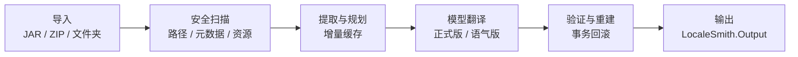

<!-- markdownlint-disable MD013 MD033 MD041 -->

<div align="center">
  

  <h1>LocaleSmith | 译匠</h1>

  <p><strong>为 Minecraft Java 内容打造的 Windows 原生 AI 本地化工作台</strong></p>
  <p>安全扫描模组与资源包，连接本地或云端模型，以可验证、可回滚的流水线生成本地化产物。</p>

  <p>
    <a href="./LICENSE"></a>
    <a href="./global.json"></a>
    <a href="./rust-toolchain.toml"></a>
    
    
  </p>

  <p>
    <a href="#项目概览">项目概览</a> ·
    <a href="#核心能力">核心能力</a> ·
    <a href="#快速开始">快速开始</a> ·
    <a href="#安全边界">安全边界</a> ·
    <a href="#开源许可">开源许可</a>
  </p>
</div>

> [!IMPORTANT]
> LocaleSmith 目前是**源码可构建的开发预览版**。现有 MSIX 使用自签名开发证书，尚未完成生产签名、可信时间戳与干净机安装矩阵，请勿将其视为正式发布件。

## 项目概览

**LocaleSmith | 译匠**，面向 Minecraft: Java Edition 模组、资源包与光影包，将**安全扫描、增量翻译、结构验证和事务重建**整合进一个 Windows 原生桌面工作台。

项目采用 Rust 原生扫描核心与 .NET 10 / WinUI 3 桌面应用：Rust 负责 JAR、ZIP、Loader 元数据和受支持字节码模式的解析，.NET 负责归档事务、模型接入、安全存储、翻译队列与用户界面。

## 核心能力

| 能力 | 说明 |
| --- | --- |
| **安全归档扫描** | 识别路径穿越、Loader 元数据、语言资源、签名证据与受支持的 Java 字符串引用。 |
| **增量翻译流水线** | 按内容哈希复用译文，校验占位符与结构，并在失败时回滚整个作业。 |
| **多模型接入** | 统一支持 Ollama、OpenAI-compatible Chat Completions 与 Anthropic Messages。 |
| **原生桌面体验** | 提供首次引导、翻译队列、双语助手、模型源管理、设置和 CLI 风险确认。 |
| **凭据与配置保护** | API Key 存入 Windows Credential Manager，其他配置使用 AES-256-GCM 加密。 |
| **受控 MCP / CLI** | 模型只能读取安全上下文并提出命令；执行必须经过策略复核和用户明确确认。 |

## 支持范围

| 类别 | 当前支持 |
| --- | --- |
| 输入 | JAR、ZIP、展开后的资源包或光影包目录 |
| Loader 元数据 | Fabric、Forge、NeoForge、Quilt、Legacy Forge |
| 文本资源 | Minecraft 语言 JSON、Legacy `.lang`、`pack.txt`、受支持的 `pack.mcmeta` 显示文本 |
| 字节码 | 经结构证明的 `Component.literal(String)` 精确模式；其他候选仅报告、不改写 |
| 模型接口 | Ollama、OpenAI-compatible Chat Completions、Anthropic Messages |
| 模型预设 | DeepSeek、Qwen、Xiaomi MiMo、MiniMax、OpenAI、豆包、智谱 GLM、Kimi，以及自定义入口 |
| 输出 | 当前作业选择的正式版或语气版；现代 Minecraft 资源名使用小写 `zh_cn` |
| 平台 | Windows x64，最低 Windows 10 1809 |

## 处理流程



每个作业只生成用户选择的一种翻译风格。另一种风格可以单独入队，并复用相同原文哈希下已经缓存的对应译文。

## 快速开始

### 环境要求

| 依赖 | 版本或说明 |
| --- | --- |
| 操作系统 | Windows 10 1809 或更高版本；WinUI 开发建议 Windows 11 |
| .NET SDK | `10.0.302`，由 `global.json` 固定 |
| Rust | 仓库工具链 `1.97.1`（MSVC），包含 `rustfmt` 与 `clippy` |
| Windows SDK | `10.0.26100`，并安装 MSVC / C++ 构建工具 |
| UI 依赖 | Windows App SDK `2.3.1`、CommunityToolkit.Mvvm `8.4.2`，由 NuGet 还原 |
| MSIX 构建 | 需要包含 Desktop Bridge / WAP targets 的 Visual Studio Developer PowerShell |

### 构建

先生成 Rust release DLL，再还原并构建 .NET solution：

```powershell
git clone https://github.com/DZXH-TX/LocaleSmith.git
Set-Location LocaleSmith

cargo build --manifest-path native/localesmith_core/Cargo.toml --release
dotnet restore LocaleSmith.slnx
dotnet build LocaleSmith.slnx -c Release
```

> [!NOTE]
> `dotnet build LocaleSmith.slnx` 不会生成 WAP / MSIX；打包工程位于 `packaging/LocaleSmith.Package`，需要在具备对应 Visual Studio targets 的开发环境中单独构建。

<details>
<summary><strong>运行完整验证门</strong></summary>

```powershell
cargo fmt --manifest-path native/localesmith_core/Cargo.toml --all -- --check
cargo clippy --manifest-path native/localesmith_core/Cargo.toml --all-targets --all-features -- -D warnings
cargo test --manifest-path native/localesmith_core/Cargo.toml --all-targets

dotnet test LocaleSmith.slnx -c Release
dotnet format LocaleSmith.slnx --verify-no-changes --no-restore
```

</details>

## 源码结构

```text
native/localesmith_core/       Rust ZIP/JAR、metadata 与 classfile 扫描核心
src/LocaleSmith.Core/           领域模型和统一服务契约
src/LocaleSmith.NativeInterop/  C ABI 投影、DLL 解析与类型化清单
src/LocaleSmith.Application/    翻译编排、增量计划、队列与事务边界
src/LocaleSmith.Archive/        安全快照、提取、重建、验证与回滚
src/LocaleSmith.Infrastructure/ 模型适配、凭据、加密、CLI 与环境检测
src/LocaleSmith.Mcp/            MCP JSON-RPC / stdio 协议与工具目录
src/LocaleSmith.McpHost/        独立 MCP 控制台宿主
src/LocaleSmith.Presentation/   可测试的 MVVM ViewModel 与 UI 契约
src/LocaleSmith.App/            WinUI 3 视图、组合根和本地应用服务
tests/                      八个 .NET 测试项目和受限 CLI probe
packaging/                  x64 WAP / MSIX manifest、双语资源和图标
```

## 安全边界

以下原则是产品行为的一部分，而不是可选配置：

- **模型不能授权命令执行。** Provider 工具循环只允许读取安全上下文和提出命令，完整命令仍需用户查看、勾选风险确认并批准。
- **签名 JAR 默认禁止修改。** 没有原作者私钥就无法保持原签名；项目只会阻断修改，或在用户明确选择后生成 unsigned copy。
- **Low IL 不等于 AppContainer。** 受限 token、私有 desktop 与 Job Object 会缩小执行面，但不会自动阻断网络，也不能阻止读取当前用户 ACL 已允许的文件。

<details>
<summary><strong>字节码外部化的精确范围</strong></summary>

当前只改写经结构证明、紧邻出现的 `ldc` / `ldc_w` 字符串与 Mojang `Component.literal(String):MutableComponent` 静态调用，并转换为精确的 `translatable(String)` 引用。实现会保持指令长度，在提交前重新扫描验证；分支或异常边界、未知 opcode、混淆代码及任何不精确模式都不会被改写。这不是通用 Java 字节码重写器，也尚未覆盖真实 Minecraft / Loader 兼容矩阵。

</details>

<details>
<summary><strong>归档重建与签名</strong></summary>

原输入始终保持不动，关键 metadata 与清单会复核，事务失败会回滚。不过 ZIP / JAR 会被重新压缩，因此不保证压缩流、extra field、条目注释或顺序在字节级完全一致。对签名归档的修改会使原签名失效；当前不提供重新签名功能。

</details>

<details>
<summary><strong>模型工具与 CLI 隔离</strong></summary>

MCP stdio Host 只暴露 `system.context` 与 `cli.propose`，不暴露 `cli.execute`。允许执行的命令必须通过动态白名单、绝对拒绝规则、工作目录与敏感参数检查，并绑定一次性确认 token；启动前审计不可写时不会启动进程。Kimi 的私有 `reasoning_content` 仅在同一 Kimi 工具循环内有界回放，不进入用户可见内容，也不会发送给其他 Provider。

</details>

<details>
<summary><strong>MSIX 开发包状态</strong></summary>

当前 manifest 版本为 `0.1.0.2`。MSIX 已完成 payload、PRI、MCP Host、SignPath Authenticode 签名、本机安装与启动验证；微软商店上架前仍需使用 Partner Center 分配的正式包身份重新生成清单并完成商店认证。

</details>

## 验证快照

以下数字是当前源码记录的验证基线，不是实时 CI 状态：

| 检查项 | 基线 |
| --- | --- |
| .NET Release | `260 / 260` tests，`0` warnings，`0` errors |
| Rust | `26 / 26` tests，`rustfmt` 与 `clippy -D warnings` 通过 |
| 双语资源 | `zh-CN` / `en-US` 各 `332` 个 key，完全对齐 |
| 源码安全审计 | FINAL GREEN，P0 / P1 / P2 均为 `0` |

这些结果证明当前自动化覆盖的源码行为，不替代外部渗透测试、真实 Provider 验证或 Minecraft / Loader 运行时兼容测试。

## 参与贡献

欢迎提交 Pull Request。提交代码前，请至少运行与改动相关的 Rust / .NET 验证门，并清楚说明目标 Minecraft 版本、Loader、输入类型和模型来源。

## 开源许可

本项目依据 [Apache License 2.0](./LICENSE) 开源。

Copyright © 2026 **DZXH-TX（道泽星河-天仙）**（版权所有者与许可人）。
