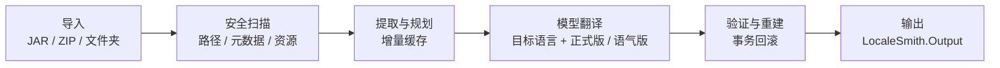

<!-- markdownlint-disable MD013 MD033 MD041 -->

<div align="center">
  

  <h1>LocaleSmith | 译匠</h1>

  <p><strong>简体中文</strong> · <a href="./README.en.md">English</a></p>

  <p><strong>为 Minecraft: Java Edition 内容打造的 Windows 原生 AI 本地化工作台</strong></p>
  <p>安全扫描模组与资源包，连接本地或云端模型，以可验证、可回滚的流水线生成本地化产物。</p>

  <p>
    <a href="./LICENSE"></a>
    <a href="./global.json"></a>
    <a href="./rust-toolchain.toml"></a>
    
    
    
  </p>

  <p>
    
    
    
    
    
  </p>

  <p>
    <a href="#项目概览">项目概览</a> ·
    <a href="#核心能力">核心能力</a> ·
    <a href="#支持范围">支持范围</a> ·
    <a href="#处理流程">处理流程</a> ·
    <a href="#快速开始">快速开始</a> ·
    <a href="#安全边界">安全边界</a> ·
    <a href="#参与贡献">参与贡献</a>
  </p>
</div>

> [!IMPORTANT]
> LocaleSmith 目前是**源码可构建的开发预览版**。现有 MSIX 使用自签名开发证书，尚未完成生产签名、可信时间戳与干净机安装矩阵，请勿将其视为正式发布件。

## 项目概览

**LocaleSmith | 译匠**，面向 Minecraft: Java Edition 模组、资源包与光影包，将**安全扫描、增量翻译、结构验证和事务重建**整合进一个 Windows 原生桌面工作台。

项目采用 Rust 原生扫描核心与 .NET 10 / WinUI 3 桌面应用：Rust 负责 JAR、ZIP、Loader 元数据和受支持字节码模式的解析，.NET 负责归档事务、模型接入、安全存储、翻译队列与用户界面。

## 核心能力

| 能力 | 说明 |
| --- | --- |
| **安全归档扫描** | 识别路径穿越、Loader 元数据、语言资源、签名证据与受支持的 Java 字符串引用。 |
| **增量翻译流水线** | 按内容哈希复用译文，校验占位符与结构，并在失败时回滚整个作业。 |
| **专业提示与术语** | 自动区分模组、资源包与光影包，使用独立领域提示；简体中文任务附带各自的专业术语对照表。 |
| **多目标语言** | 首批支持简体中文、英语、日语、法语与俄语；语言目录集中定义，可继续扩展。 |
| **多模型接入** | 统一支持 Ollama、OpenAI-compatible Chat Completions 与 Anthropic Messages。 |
| **提供方预设** | DeepSeek、Qwen、Xiaomi MiMo、MiniMax、OpenAI、豆包、智谱 GLM 与 Kimi 等预设会同步填充服务地址和模型名，并选择推荐的补全 Token 参数；也可明确选择不发送该参数。 |
| **联机模组社区** | 可搜索和分页浏览公开模组与讨论；使用保存在 Windows Credential Manager 中的 PAT 发帖、回复和举报，并可直接查看服务条款与社区规范。 |
| **持久化诊断日志** | 日志目录可写时，每次翻译都会尝试通过有界后台写入器持久化一对 Debug 与 All levels `.log`；可在左侧“日志”页查看并在引导或设置中修改目录。 |
| **原生桌面体验** | 提供首次引导、处理队列、模型助手、模型源管理、日志、设置和 CLI 风险确认。 |
| **凭据与配置保护** | API Key 存入 Windows Credential Manager，其他配置使用 AES-256-GCM 加密。 |
| **受控 MCP / CLI** | 模型只能读取安全上下文并提出命令；执行必须经过策略复核和用户明确确认。 |

## 支持范围

| 类别 | 当前支持 |
| --- | --- |
| 输入 | JAR、ZIP、展开后的资源包或光影包目录 |
| Loader 元数据 | Fabric、Forge、NeoForge、Quilt、Legacy Forge |
| 文本资源 | Minecraft 语言 JSON、Legacy `.lang`、光影包 `shaders/lang/*.lang`、`pack.txt`、受支持的 `pack.mcmeta` 显示文本 |
| 字节码 | 经结构证明的 `Component.literal(String)` 精确模式；其他候选仅报告、不改写 |
| 模型接口 | Ollama、OpenAI-compatible Chat Completions、Anthropic Messages |
| 模型预设 | DeepSeek、Qwen、Xiaomi MiMo、MiniMax、OpenAI、豆包、智谱 GLM、Kimi，以及自定义入口 |
| 目标语言 | `zh_CN`、`en_US`、`ja_JP`、`fr_FR`、`ru_RU` |
| 输出 | 当前作业选择的一种目标语言与一种翻译风格；包内资源名使用小写 Minecraft locale，如 `ja_jp` |
| 平台 | Windows x64，最低 Windows 10 1809 |

## 处理流程



每个作业会在入队时冻结用户选择的目标语言、模型源和一种翻译风格。语言资源优先使用非目标语言的 `en_us`、`en_gb` 或其他现有 locale 作为源文；例如目标为英语但包内只有日语时，会从日语生成 `en_us`。另一种风格可以单独入队，并复用相同原文哈希下已经缓存的对应译文。

## 翻译日志与持久化设置

左侧导航中的“日志”页按翻译作业列出持久化记录，并默认显示 Debug 视图；切换到 All levels 可查看包含细粒度进度在内的完整级别记录。日志是最大限度的后台诊断功能：目录正常可写且写入器有容量时，作业会创建一对 `.debug.log` / `.all.log` 文件并增量刷新到磁盘；慢设备或队列已满时可能跳过文件或丢弃部分诊断条目，但不会阻塞翻译。进程异常退出后，已经成功刷新的内容仍可用于定位最后一个阶段。

默认目录为 `%LOCALAPPDATA%\LocaleSmith\logs\translations`。首次引导和“设置”页都可以浏览或手动修改为本地目录；更改保存后从下一次翻译起生效，并会在软件关闭时与语言、主题、工作区等最后一次有效设置一起写入加密配置。程序只保留并列出最新 500 次会话；清理仅匹配 LocaleSmith 自有命名格式，不删除目录内的其他文件。日志仅记录任务 ID、包文件名、阶段、进度、结果与错误类型，不写入 API Key、完整提示词或用户选择路径的父目录；常见 Bearer / Token / API Key 形式还会在写盘前再次脱敏。

## 快速开始

### 环境要求

| 依赖 | 版本或说明 |
| --- | --- |
| 操作系统 | Windows 10 1809 或更高版本；WinUI 开发建议 Windows 11 |
| .NET SDK | `10.0.302`，由 `global.json` 固定 |
| Rust | 仓库工具链 `1.97.1`（MSVC），包含 `rustfmt` 与 `clippy` |
| Windows SDK | `10.0.26100`，并安装 MSVC / C++ 构建工具 |
| UI 依赖 | Windows App SDK `2.3.1`、CommunityToolkit.Mvvm `8.4.2`，由 NuGet 还原 |
| MSIX 构建 | 需要包含 Desktop Bridge / WAP targets 的 Visual Studio Developer PowerShell |

### 构建

先生成 Rust release DLL，再还原并构建 .NET solution：

```powershell
git clone https://github.com/DZXH-TX/LocaleSmith.git
Set-Location LocaleSmith

cargo build --manifest-path native/localesmith_core/Cargo.toml --release
dotnet restore LocaleSmith.slnx
dotnet build LocaleSmith.slnx -c Release
```

> [!NOTE]
> `dotnet build LocaleSmith.slnx` 不会生成 WAP / MSIX；打包工程位于 `packaging/LocaleSmith.Package`，需要在具备对应 Visual Studio targets 的开发环境中单独构建。

<details>
<summary><strong>运行完整验证门</strong></summary>

```powershell
cargo fmt --manifest-path native/localesmith_core/Cargo.toml --all -- --check
cargo clippy --manifest-path native/localesmith_core/Cargo.toml --all-targets --all-features -- -D warnings
cargo test --manifest-path native/localesmith_core/Cargo.toml --all-targets

dotnet test LocaleSmith.slnx -c Release
dotnet format LocaleSmith.slnx --verify-no-changes --no-restore
```

</details>

## 源码结构

```text
native/localesmith_core/       Rust ZIP/JAR、metadata 与 classfile 扫描核心
src/LocaleSmith.Core/           领域模型和统一服务契约
src/LocaleSmith.NativeInterop/  C ABI 投影、DLL 解析与类型化清单
src/LocaleSmith.Application/    翻译编排、增量计划、队列与事务边界
src/LocaleSmith.Archive/        安全快照、提取、重建、验证与回滚
src/LocaleSmith.Infrastructure/ 模型适配、凭据、加密、CLI 与环境检测
src/LocaleSmith.Mcp/            MCP JSON-RPC / stdio 协议与工具目录
src/LocaleSmith.McpHost/        独立 MCP 控制台宿主
src/LocaleSmith.Presentation/   可测试的 MVVM ViewModel 与 UI 契约
src/LocaleSmith.App/            WinUI 3 视图、组合根和本地应用服务
tests/                      八个 .NET 测试项目和受限 CLI probe
packaging/                  x64 WAP / MSIX manifest、五语言资源和图标
```

## 安全边界

以下原则是产品行为的一部分，而不是可选配置：

- **模型不能授权命令执行。** Provider 工具循环只允许读取安全上下文和提出命令，完整命令仍需用户查看、勾选风险确认并批准。
- **签名 JAR 默认只生成明确的 unsigned 副本。** 原 JAR / ZIP 始终保持不动；应用翻译队列只在独立输出中移除签名块、`SIG-*` 与失效的 manifest 摘要声明，底层调用仍可选择完全阻断，且项目绝不冒充原签名或哈希。
- **CLI 不搜索进程 PATH。** 默认不信任任何进程型可执行文件；后续显式白名单必须使用已批准的绝对路径。私有 CLI 沙箱默认位于 `%LOCALAPPDATA%\LocaleSmith\CliSandbox`，并在创建前后检查重解析点。
- **客户端不携带 Cloudflare 源站密钥。** `api.dzxh-tx.cn` 使用系统信任库完成普通服务器 TLS 验证；Authenticated Origin Pulls 只认证 Cloudflare 到源站的连接，其证书和私钥不得进入应用、MSIX 或仓库。
- **Low IL 不等于 AppContainer。** 受限 token、私有 desktop 与 Job Object 会缩小执行面，但不会自动阻断网络，也不能阻止读取当前用户 ACL 已允许的文件。

<details>
<summary><strong>字节码外部化的精确范围</strong></summary>

当前只改写经结构证明、紧邻出现的 `ldc` / `ldc_w` 字符串与 Mojang `Component.literal(String):MutableComponent` 静态调用，并转换为精确的 `translatable(String)` 引用。实现会保持指令长度，在提交前重新扫描验证；分支或异常边界、未知 opcode、混淆代码及任何不精确模式都不会被改写。这不是通用 Java 字节码重写器，也尚未覆盖真实 Minecraft / Loader 兼容矩阵。

</details>

<details>
<summary><strong>归档重建与签名</strong></summary>

原输入始终保持不动，所有结构和行为调整只发生在事务工作副本与独立输出中；逐项验证 JSON / lang / manifest、Java class、Loader、服务及资源引用后才会原子提交，失败不会发布半成品。不过 ZIP / JAR 会被重新压缩，因此不保证压缩流、extra field、条目注释、顺序或 Loader 行为兼容性在字节级完全一致。预编译 JAR 只报告静态字节码与资源验证，绝不声称“源码编译通过”；若输入含源码和 Gradle / build 入口，当前因没有真正隔离的构建器而失败关闭，且不会直接执行归档内脚本。

</details>

<details>
<summary><strong>模型工具与 CLI 隔离</strong></summary>

MCP stdio Host 只暴露 `system.context` 与 `cli.propose`，不暴露 `cli.execute`。允许执行的命令必须来自已经批准的绝对路径，并通过绝对拒绝规则、工作目录与敏感参数检查，再绑定一次性确认 token；启动前审计不可写时不会启动进程。Kimi 的私有 `reasoning_content` 仅在同一 Kimi 工具循环内有界回放，不进入用户可见内容，也不会发送给其他 Provider。

</details>

<details>
<summary><strong>MSIX 程序包状态</strong></summary>

当前 Store manifest 使用 Partner Center 分配的正式身份，程序包版本为 `1.0.0.0`；应用自身仍处于 `0.1.0` 预览阶段，两者独立版本化。仓库中的历史开发包曾完成 payload、PRI、MCP Host、SignPath Authenticode 签名与本机启动验证，但该证据不覆盖当前源码；提交 Microsoft Store 前需重新生成 MSIX，并在 Partner Center 的提交选项中说明和申请 `runFullTrust` 受限功能。

正式 Identity `CRTech.LocaleSmith` 不会原位升级早期的 `LocaleSmith.Desktop` / `JaxI18n.Desktop` 开发包，Windows 会暂时并列安装。切换时请关闭旧程序；新程序会继续使用用户级 `%LOCALAPPDATA%\LocaleSmith`，并只读检查仍已注册的旧包重定向数据。确认新版本工作正常后再卸载旧开发包。

</details>

## 验证快照

以下数字是当前源码记录的验证基线，不是实时 CI 状态：

| 检查项 | 基线 |
| --- | --- |
| .NET Release | `558 / 558` tests，`0` warnings，`0` errors |
| Rust | `27 / 27` tests，`rustfmt` 与 `clippy -D warnings` 通过 |
| 五语言资源 | `zh-CN` / `en-US` / `ja-JP` / `fr-FR` / `ru-RU` 各 `485` 个 key，完全对齐 |
| 源码安全审计 | 本地路径、归档、CLI、凭据和迁移回归门通过；GitHub CodeQL 结果以当前提交的远端重扫为准，不在 README 中宣称零告警 |

这些结果证明当前自动化覆盖的源码行为，不替代外部渗透测试、真实 Provider 验证或 Minecraft / Loader 运行时兼容测试。

## 参与贡献

欢迎提交 Pull Request。提交代码前，请至少运行与改动相关的 Rust / .NET 验证门，并清楚说明目标 Minecraft 版本、Loader、输入类型和模型来源。

## 开源许可

本项目依据 [Apache License 2.0](./LICENSE) 开源。

## 人工智能使用声明

本项目允许在需求分析、代码与文档草拟、重构建议、测试设计和本地化等环节使用生成式人工智能工具。所有 AI 辅助产出必须经过人工审阅、必要测试以及安全与许可核验后方可提交；维护者和贡献者仍对其提交内容的正确性、安全性、合规性和可维护性承担完整责任，AI 输出不构成事实、法律或专业保证。

使用 AI 工具时，不得向未经授权的外部服务上传密钥、凭据、个人信息、未公开源码或受限制的第三方内容，并应遵守相应服务条款与第三方许可证。对项目有实质影响的 AI 辅助内容，贡献者应在 Pull Request 中如实说明；本声明不改变 Apache License 2.0 下的许可、版权与贡献归属。

Copyright © 2026 **DZXH-TX（道泽星河-天仙）**（版权所有者与许可人）。
