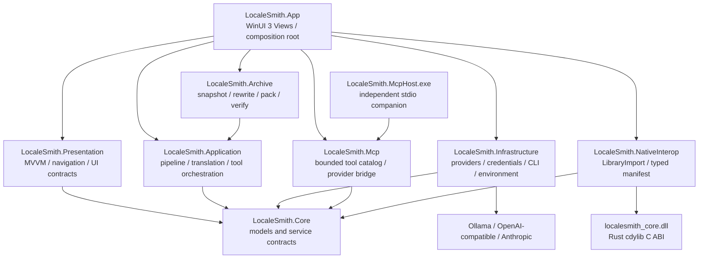
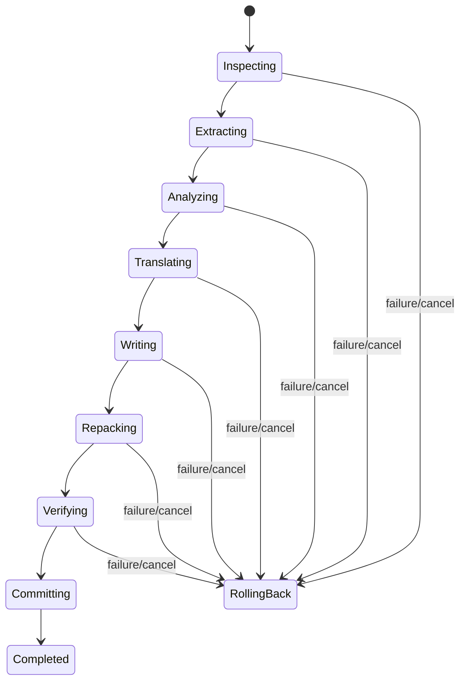

# LocaleSmith | 译匠 当前架构

> 状态：功能边界同步至 2026-08-24 当前源码；文末验证数字保留其已记录基线
> 范围：WinUI 3、.NET 10、Rust C ABI、模型适配、MCP/CLI、归档翻译与 x64 MSIX

## 1. 结论

- 桌面宿主为 WinUI 3 + .NET 10；Rust 以 `cdylib` 生成 `localesmith_core.dll`，C# 通过 `[LibraryImport]` 调用稳定 C ABI。当前没有 WinMD/WinRT Component，也没有伪装成“静态库”的 DLL。
- View 只负责呈现、输入和确认；状态/命令位于 CommunityToolkit.Mvvm ViewModel；HTTP、Credential Manager、文件事务、CLI policy 和 Rust 调用由上层服务实现。
- JAR/ZIP/目录输入在事务工作区处理。输入不原地改写；每个作业只把入队时所选的一种风格作为单一产物暂存、验证并提交，失败回滚。
- 三个 provider 都支持各自原生的工具调用格式。基础工具只能读取安全上下文或提出 CLI；App 内选中活动模组项目后可增加受限项目工具，但独立 stdio Host 没有该 backend。CLI 执行始终经过独立 WinUI 风险确认和一次性批准。
- 字节码改写仅覆盖经证明的 Mojang `Component.literal(String)` 精确模式。归档重建不是 byte-for-byte 无损，修改签名 JAR 必然使原签名失效。

## 2. 实际项目与依赖方向

当前不存在 `LocaleSmith.Domain`、`LocaleSmith.Host`、独立 `CliBroker.exe` 或 `ArchiveWorker.exe` 项目。Rust DLL 与 Host 同进程、同权限；受限 CLI 是由 Host 启动的 Low IL 子进程。因此文档不得把进程外故障隔离或 AppContainer 当成已实现能力。

依赖规则：

- `LocaleSmith.App` 是组合根和 XAML 层；code-behind 只做页面事件、焦点/快捷键和对话框编排。
- `LocaleSmith.Presentation` 不持有 `HttpClient`、API Key 或 P/Invoke。
- `LocaleSmith.Application` 只依赖契约，负责队列、增量、翻译和模型工具循环。
- `LocaleSmith.Archive` 实现 `IArchiveWorkspaceBackend`，所有修改发生在本作业 staging。
- `LocaleSmith.Infrastructure` 实现 provider、Credential Manager、AES-GCM、系统环境检测和 CLI 安全执行。
- `LocaleSmith.NativeInterop` 是唯一托管 C ABI 投影；Rust 不回调或访问 WinUI。

## 3. Rust C ABI

`native/localesmith_core` 使用 `crate-type = ["cdylib"]`。Rust 负责安全路径和 ZIP/JAR 清单扫描、loader 元数据与 `modId` 检测、语言资源/签名证据和 classfile 字符串引用发现。C ABI 返回 UTF-8 JSON，由 .NET 投影成类型化 `ArchiveScanManifest`。

边界规则：

- 不导出 Rust `String`、`Vec<T>`、trait object 或不稳定 enum 布局。
- Rust 分配的缓冲只能由配对的 Rust free 接口释放；错误码和 JSON 长度均受检查。
- panic 不得越过 C ABI；C# 使用固定调用约定和 x64 DLL 解析。
- Rust safe core 不等于整个进程内存安全；FFI 声明、第三方解析器和同进程 native crash 仍属于残余风险。

当前选择 C ABI 而不是 WinMD，是因为只有 .NET Host 消费 Rust。`.winmd` 只描述 WinRT 类型，不能把一组 C 函数自动变成 WinRT Component；若以后需要其他 WinRT 语言消费者，应另建经验证的桥接层。微软关于源生成 P/Invoke 的建议见 [.NET native interoperability best practices](https://learn.microsoft.com/dotnet/standard/native-interop/best-practices)。

## 4. 翻译与归档流水线

实际语义：

1. 文件输入以只读共享锁处理；目录输入先在 `%TEMP%/LocaleSmith/workspaces/<job>` 生成不可变 ZIP 快照，并在复制前/中/后与最终 inventory 中复核 metadata 和 SHA-256。
2. 路径检查拒绝绝对/逃逸路径、UNC、ADS、Windows 设备名、碰撞、symlink/junction/reparse point，以及配置的深度、条目数和大小上限。
3. `modId` 按 Quilt → Fabric → NeoForge → Forge/NeoForge legacy → `mcmod.info` 读取；描述符不可用时才使用规范化 JAR 文件名 fallback，并保留 warning。
4. 读取 `.json`、`.lang`、`pack.txt` 和支持 schema 的 `.mcmeta` 用户可见字段；现代资源 locale 使用小写 `zh_cn`。
5. 每个作业的严格 JSON contract 只允许所选的 formal 或 informal 单字段；占位符和模型返回的 EntryId 在写包前验证。另一风格通过独立作业生成。
6. 暂存产物重新打开并验证归档、资源和关键 metadata；commit 之后才保存翻译缓存。若缓存保存失败，已验证产物保持成功，只提示下一次可能重新翻译。

Dashboard 接受源 artifact 时，`InMemoryModProjectWorkspace` 按规范化源路径在当前进程内注册或复用一个项目，并把队列 job 绑定为项目 task；进度、取消、终态、验证后产物和 Provider 已报告的模型用量通过同一 task 快照同步到助手。任务失败或取消时会保留此前完成轮次的 usage；在途调用没有 usage 时明确标为部分/不可用。这个工作区没有磁盘存储，应用重启后项目、task 与项目会话不会恢复。项目层只是任务/上下文投影：源 artifact 仍是只读输入，输出仍由既有事务工作区完成 staging、验证和 commit。

普通翻译条目按 `MaxSourceCharactersPerRequest` 和条目数目标分块。超过字符目标的单条值保持原样并独占一个模型请求，不做不安全的拆条、截断或所谓自动压缩；若它超过所选 provider 的真实上下文或输出能力，由 provider 返回可诊断错误，事务流水线不会提交部分产物。

输出路径不是进程启动时冻结的常量。`DefaultOutputPathStrategy` 在每个新作业调用时重新加载加密配置，把结果放在最新 `<WorkspacePath>/LocaleSmith.Output` 中，并为同源同语言的并发/重复任务预留不覆盖的递增文件名；磁盘/共享根、reparse hierarchy、逃逸路径及目录源的后代路径仍被拒绝。

增量缓存使用 `localesmith.translation-memory/v2` 命名空间，键覆盖原始包身份、目标语言、作业开始时捕获的 `ModelSourceId` 和单风格翻译契约版本 `minecraft-java-localization-json/v2-single-style`。相同原文哈希的不同风格在独立作业间合并复用；旧契约或旧两段式缓存不会被误复用，而是安全 miss。

### 4.1 重建和签名的准确含义

| 项目 | 当前保证 |
| --- | --- |
| 原输入 | 永不作为写目标；失败/取消时保持不变 |
| 未修改的解压后 payload | 以内容/哈希复核 |
| 关键 metadata | 保留并重新解析验证 |
| formal/informal | 每个作业只提交所选风格的一个产物；不同风格由独立作业生成，缓存变体不互相覆盖 |
| ZIP 原压缩流、extra fields、注释、条目顺序和整个文件字节 | **不保证相同**；重压缩可能改变它们 |
| 原 JAR 签名 | 修改后必然失效；默认阻断或显式 unsigned copy；当前不重签 |

## 5. 精确字节码安全子集

常量池中的 `CONSTANT_String` 可能是 UI、路径、反射键、正则、日志或控制值，所以“扫描到”不等于“可改写”。当前只对以下结构执行外部化：

- `ldc`/`ldc_w` 加载字符串；
- 下一条指令是精确的 `net/minecraft/network/chat/Component.literal(String):MutableComponent` 静态调用；
- 没有 branch、switch target 或 exception-table boundary 进入该调用；
- classfile、constant pool、opcode 和选择指纹均可完整解析且仍与分析时一致。

重写器先对整个候选集合规划 constant-pool 容量，再追加独立 constant-pool 链并保持指令长度。若新增索引超过窄 `ldc` 的 1-byte 能力，该候选会记录 warning 并跳过，其他安全候选与普通语言资源继续处理；实现不会在没有完整重写 branch/exception/StackMap 偏移的情况下冒险扩展为 `ldc_w`。成功候选把调用改为精确 `translatable(String)`，原文写入 `assets/<modid>/lang/en_us.json` fallback，相同 key 进入普通增量翻译并生成本作业所选风格的目标语言条目。目标 locale 为 `en_us` 时拒绝该流程。staging 在提交前重新扫描 class 引用、fallback 和所选目标条目；任何已选择改写的不一致仍回滚整个作业。

这不是任意 Minecraft/loader/混淆版本的通用重写器，也没有真实游戏运行时兼容矩阵。其他硬编码字符串只作为只读候选报告。

## 6. 模型、工具与助手

`IModelService.CompleteAsync(ModelRequest)` 是统一接口，当前实现：

- Ollama：`/api/chat` 与 `/api/tags`；默认服务 `http://127.0.0.1:11434`。
- OpenAI-compatible：Chat Completions 消息、`tools` 和 `tool_calls`。
- Anthropic Messages：顶层 `system`、`tools`/`input_schema`、`tool_use`/`tool_result` 和显式 `anthropic-version`。

`ModelToolOrchestrator` 将 provider-native 调用归一化为 `ModelToolCall`，默认最多 8 轮、总计 32 次调用，拒绝重复 call id，限制工具结果长度并只回传脱敏错误类型。正常文本翻译仍使用严格翻译 contract；助手会话才带工具。

编排器同时产生无内容的确定性 `ModelRunEvent`：模型轮次开始/完成、工具开始/完成/失败，以及运行完成/失败/取消。事件只携带序号、轮次、公开工具名和可选用量，不携带消息正文、工具参数/结果、文件路径、命令、异常文本或模型私有推理。助手 UI 以这些事件显示处理活动，而不是展示模型的思维链。

DeepSeek、Xiaomi MiMo、智谱 GLM 与 Kimi 的官方预设会把私有 `reasoning_content` 作为协议状态保存在 `ModelResponse`/assistant `ModelMessage`，只在同一工具调用循环的后续同源请求中回放。MiniMax 使用 `reasoning_split=true`，把结构化 `reasoning_details` 以有界原始 JSON 保存并按数组回放，从而让普通 `content` 保持可见答案/严格 JSON。DeepSeek/MiMo 需要的空 tool-call content 会序列化为 `""` 而非 `null`。这些状态不拼接到可见内容、不进入 UI 会话历史，也不会跨 provider 发送；单字段 256 KiB 与总 transcript 1 MiB 上限仍适用。

助手会话键为 `ProjectId + ModelSourceId`（通用助手使用空 ProjectId）。每个键分别保存可见 user/assistant 历史与草稿；切换项目或模型源会取消当前进行中的请求并激活对应会话，不删除其他键的上下文，也不会把上一 provider 或另一个模组的历史混入新请求。会话与项目工作区一样只在当前进程内存在。

助手 UI 和 App service 不对用户消息或历史设置固定字符/条数门槛，ViewModel 不修剪旧 user/assistant turn；选中 source 收到完整 UI 会话，或返回可诊断的上下文错误。Chat Completions 不被假定会自动压缩。只有机器上下文注入保留 32 KiB 限制，provider HTTP 响应/错误体、tool arguments/结果/次数和 orchestrator transcript 仍用安全边界。

`ModelTokenUsage` 只聚合 provider 响应中实际返回的 input、output 与 total。Provider total 优先；没有 total 时，只有同一响应同时报告 input/output 才计算精确和。每个 provider call 都计数，任一调用缺失或只返回部分 usage 时，聚合会明确标为不完整；实现不按字符、字节或条目数估算。该结构贯穿助手完成结果与分块翻译/流水线/队列/项目 task；失败或取消时保留已完成轮次的已报告用量，在途或未返回 usage 的调用只标记为部分/不可用，不伪造数值。

基础模型工具为：

| provider 名称 | MCP 名称 | 可用范围 | 能力 |
| --- | --- | --- | --- |
| `system_context` | `system.context` | App + 独立 stdio Host | 返回有界、脱敏的 Windows/Shell/allowlisted environment 上下文 |
| `cli_propose` | `cli.propose` | App + 独立 stdio Host | 校验和汇总命令提议；不执行、不签发 approval |

App 组合根注入 `ProjectMcpBackend`。助手选中项目后增加三个只读项目工具；两个写工具仅在用户勾选本轮一次性项目变更授权后增加：

| provider 名称 | MCP 名称 | 能力 |
| --- | --- | --- |
| `project_get_active` | `project.get_active` | 返回本轮捕获的项目与不透明 task ID，不接受路径 |
| `archive_inspect` | `archive.inspect` | 只读扫描活动项目已登记的 JAR/ZIP 源 artifact |
| `translation_start` | `translation.start` | 复用真实 inspect/extract/translate/repack/verify/commit 队列与事务流水线 |
| `task_status` | `task.status` | 返回活动项目中真实 task 的队列阶段、进度、终态、产物与可用 usage |
| `task_cancel` | `task.cancel` | 通过真实队列句柄请求取消；既有流水线负责回滚 |

所有项目工具都绑定本轮捕获的 `ProjectId`，只接受项目/任务的不透明 GUID；模型不能改写项目或本轮选定的模型源，也不能选择任意主机路径。同一项目不能并发启动第二个活动翻译 task。`translation_start` 与 `task_cancel` 只有本轮用户授权时可见。独立 `LocaleSmith.McpHost` 构造 `McpStdioServer` 时没有 App backend，因此其工具目录仍只有 `system.context` 与 `cli.propose`。

不存在模型可见的 `cli_execute`。`AssistantPage` 收到提议后，逐条打开现有 CLI 确认对话框；只有用户勾选风险、再次确认且 policy 仍通过时才进入 `ICliRunner`。助手页、首次引导、Dashboard、模型源、设置和 CLI 确认均提供 `zh-CN`/`en-US` 资源，UI 设计约束记录在 `design-system/LocaleSmith`。

系统上下文被标记为不可信数据，且只包含 allowlist 后的信息。由于用户明确要求为命令生成注入机器上下文，选择云 provider 时这些安全化上下文仍会发往该 provider；这属于应由用户知晓的数据出站边界。

## 7. 配置、Credential Manager 与事务

- 非秘密配置使用 AES-256-GCM：32-byte master key、12-byte nonce、16-byte tag 和 AAD；master key 存在 Windows Credential Manager。
- 每个云模型源使用独立 credential reference；UI/ViewModel 只持“是否配置”和短指纹，不显示明文 Key。
- 模型源新增/编辑/切换 Ollama/删除时，凭据写入或删除与加密配置提交组成补偿式事务。配置保存失败时恢复上一 credential；临时 `char[]` 在 finally 中用 `CryptographicOperations.ZeroMemory` 清理。
- 只有完整 PFN `CRTech.LocaleSmith_pxtspj1qm7b2r` 能使用生产根 `%LOCALAPPDATA%\LocaleSmith` 与凭据前缀 `LocaleSmith`。unpackaged、`CRTech.LocaleSmith.Dev` 及其他身份一律使用 `%LOCALAPPDATA%\LocaleSmith.Dev` / `LocaleSmith.Dev`；语言 bootstrap、配置、translation memory、日志、Sandbox、CLI audit 和安全锁共用同一 channel-aware root。
- 上述是逻辑 LocalAppData 根。registered MSIX 的物理写入可由 Windows 放入各自 PFN 的 `LocalCache\Local`；PFN 仍提供隔离。manifest 不申请 `unvirtualizedResources`，避免为共享 AppData 扩大 restricted capability；unpackaged Dev 直接写用户级 `LocaleSmith.Dev`。
- Dev 不运行旧 JaxI18n/历史 package 数据与凭据迁移。生产迁移保留只读发现、复制后不删除源数据；schema 只允许 1..4，未知未来或非正版本在任何字段归一化前 fail closed。
- Credential Manager 保护静态存储和跨账户访问，但不能抵御控制同一 Windows 用户会话的恶意进程、调试器或进程内注入。

## 8. CLI 执行边界

执行顺序固定为：

1. `SafeCliCommandPolicy` 解析绝对 executable、动态 allowlist、超时、WorkingDirectory 和路径参数；拒绝 shell/LOLBins、环境展开、目录逃逸及绝对 regex blacklist。Windows `/Windows/...` 这类 drive-root-relative 路径在识别 option 之前按 rooted path 解析；relative path 穿越 junction、NUL/malformed path 或 canonicalization 异常全部 fail closed。
2. 任一参数只要包含大小写不敏感的 `api-key`/`api_key`/`apikey`、`token`、`secret`、`password` 或 `credential` 标记，就以 `SensitiveArgumentNotAllowed` 在批准前拒绝；用户不能批准一个已被脱敏而无法核对的 secret 值。
3. UI 展示完整命令。用户勾选“我已知晓风险”后，`CliApprovalService` 为规范化命令签发一次性 token；参数变化或重复使用都会失败。
4. runner 在调用 native launcher 前先写 `Started` JSONL 记录；同一次尝试的 start/terminal 记录共享随机 correlation id。预启动审计失败会直接返回 failed，进程启动次数保持为零。
5. `WindowsRestrictedProcessLauncher` 用 `CreateRestrictedToken(DISABLE_MAX_PRIVILEGE | LUA_TOKEN)` 创建 token，再用 `SetTokenInformation` 设 Low IL SID `S-1-16-4096`。
6. 为子进程创建带 Low mandatory label 的私有 desktop；仅显式 stdio pipe handles 进入继承列表，环境块受控。
7. `CreateProcessAsUserW` 以 suspended/no-window 方式启动绝对应用路径；带 process/time、最多 16 个进程、512 MiB 单进程、1 GiB Job、50% CPU hard cap、UI restrictions 和 kill-on-close 的 Job 在 `ResumeThread` 之前完成分配。任一步失败都终止并记录，不回退到 `Process.Start`。
8. 默认/最大超时为 30 秒；超时、取消和关闭 Job 会终止进程树，terminal 结果使用同一 correlation id 写入 JSONL 审计。

绝对 blacklist 至少包含 `::`、任何大小写 `Format`、`rd/rmdir /s /q`、`del /f /s`、`Remove-Item -Recurse -Force`、`> nul`、encoded command 和提权/动态执行工具；shell chaining、重定向和命令替换也拒绝。默认动态发现仅信任 Program Files 下无 reparse point 的 `dotnet.exe`，额外 executable 必须通过 Host 管理的 allowlist。

安全边界必须如实描述：Low IL restricted token + private desktop + Job Object 不是 AppContainer。它不会默认阻止网络，也不能阻止读取当前用户 ACL 允许的文件。WorkingDirectory 和路径参数限制是应用层校验；可执行程序仍可能通过未识别的非路径参数访问外部资源。Low IL 只有在目标对象的 Mandatory Integrity Control 允许时才能写入，所以用户选择的 Sandbox 不自动成为可写沙箱。

## 9. MSIX 与本地化

- `LocaleSmith.App` 可 unpackaged 调试；`packaging/LocaleSmith.Package` 是不在 solution 内的 x64 WAP 工程。
- payload 包含 App、Rust DLL、MCP Host、Windows App SDK/VCLibs 依赖声明、五语言 PRI 和四种 PNG。
- App/MCP Host 使用 self-contained、非 single-file、非 trimming 的 `win-x64` publish；无需单独 .NET 10 Desktop Runtime，但仍需要 manifest 声明的 Windows App Runtime 2.x 与 VCLibs framework package。
- manifest 使用 `Windows.FullTrustApplication`/`runFullTrust`；MSIX 身份不是 AppContainer。打包桌面应用在这里仍是 full-trust Host。
- `Package.appxmanifest` 的下一版 Store 源码版本为 `1.2.0.0`、Identity Name 为 `CRTech.LocaleSmith`；开发 manifest 使用同版本 `CRTech.LocaleSmith.Dev`。WAP 的空 `PackageFlavor` 默认 `Development`，只有显式 `Store` 才选择 Partner Center manifest。两者均可生成未签名审计件，但只有 Store 认证后的正式包可以描述为发布件。
- WAP 把 XBF/MRT 合并到包根 `resources.pri`，包内 App EXE 不是可抽离的 unpackaged 交付物。CI/local 门禁使用 `Rebuild`、`makepri dump` 与 publish-to-payload 全量哈希比较，避免复用旧 schema/程序集。
- 测试 Publisher 为 `CN=CR Tech, O=CR Tech, C=CN, S=重庆市, L=两江新区, E=xinghedaoze@gmail.com`，与 SignPath 测试证书 Subject 精确匹配；证书 thumbprint 为 `4D5E3819A4A3694A6E0A3BC4F24926054552A349`。该证书是自签名测试证书，不是微软商店发布身份。

生产发布仍需可信签名/时间戳、干净机安装/升级/卸载、真实 provider、Minecraft loader/version、WinUI 键盘/读屏/高对比度，以及 x64 之外架构的验证。MSIX 签名要求见 [MSIX package signing overview](https://learn.microsoft.com/windows/msix/package/signing-package-overview)。

本文当前源码自动化基线为 .NET Release 855/855、0 warnings/0 errors、format clean，Rust 28/28，五种 App `.resw` 各 676 个 key 且对齐。源码复审未发现仍存在的高/中优先级问题；这不等于外部渗透测试，也不改变 Low IL、同用户、网络、归档签名和真实 Minecraft 兼容性残余风险。

## 10. 相关文档

- [安全威胁模型](security-threat-model.md)
- [实施路线图](implementation-roadmap.md)
- [验证记录](verification.md)
- [MSIX 构建说明](../packaging/README.md)
