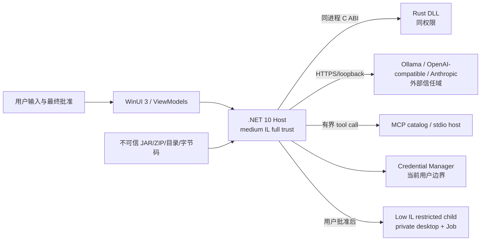

# LocaleSmith | 译匠 安全威胁模型

> 状态：与当前源码一致；未实现能力明确列为残余风险。
> 方法：按实际信任边界和 STRIDE 风险记录，不把 UI 警告当作沙箱

## 1. 安全目标和不能保证的事项

安全目标：

- 不可信 JAR/ZIP/目录不能通过路径穿越、reparse point、ADS 或资源耗尽逃出事务工作区；失败/取消不修改输入或上一次成功输出。
- API Key 和 AES master key 不写入明文配置、模型提示、CLI 参数、完整环境或普通日志。
- 模型只能读取安全化系统上下文和提出命令；不能批准、签发 token 或直接执行 CLI。
- CLI 必须经过完整展示、勾选风险确认、一次性批准、动态 allowlist/绝对 blacklist、Low IL restricted token、私有 desktop、Job Object、超时和审计。
- 只对结构完全证明的字节码模式改写；不确定项保持原样。
- 修改签名 JAR 时准确说明原签名失效；不冒充原作者 signer。

当前不能保证：

- Credential Manager/AES-GCM 不能抵御已控制同一 Windows 用户会话的恶意程序、调试器、键盘记录器或进程内注入。
- Low IL restricted token 不是 AppContainer；不能阻止读取用户 ACL 允许的文件，也不默认阻断网络。
- `WorkingDirectory` 和参数路径策略不是内核文件系统隔离；允许的 executable 若有其他寻址方式，仍可能访问 sandbox 外资源。
- Low IL 写入由 Windows Mandatory Integrity Control 决定。未带允许 Low IL 写入标签的用户 Sandbox 可能不可写；应用当前不会把任意用户目录自动变成强制访问控制沙箱。
- Rust safe code 不消除 FFI、同进程 native DLL、第三方 ZIP/JSON 库或 Windows API 的漏洞。
- 静态扫描和一个精确 adapter 无法提取所有运行时、反射、加密、native、混淆或其他 Minecraft 版本的 UI 字符串。
- 重建归档不保证 byte-for-byte 相同；任何被签名内容变化都会使原 Java 签名失效。
- 自签、无时间戳的开发 MSIX 不是可信生产分发件。

## 2. 实际信任边界



WinUI/MSIX Host 是 full-trust desktop process，并非 AppContainer。Rust 与归档解析当前也在 Host 进程内。CLI 是受限子进程，但不是独立 Broker 服务；MCP Host 作为 stdio companion 不暴露执行工具。

## 3. 风险登记

| ID | 类别 | 攻击路径 | 当前控制 | 残余风险 |
| --- | --- | --- | --- | --- |
| T01 | Spoofing/Disclosure | 恶意模型 endpoint 获取错误 provider 的 Key | source 与 credential reference 一对一；只允许 HTTP(S)，非 loopback 强制 HTTPS；禁止 URI userinfo/query/fragment；不自动 redirect；响应 origin 复核 | 没有 DNS/IP/企业代理级 SSRF 隔离；用户可配置恶意 HTTPS endpoint |
| T02 | Tampering | 修改 AES 配置或丢失 master key | AES-256-GCM tag/AAD、长度上限、临时文件/重新解密验证和原子替换；master key 在 Credential Manager | 同用户恶意进程仍可读 credential 或改进程内状态 |
| T03 | Tampering | 模型源配置提交失败后留下错误/孤儿 Key | save/delete/切换 provider 使用补偿事务；恢复旧 credential；临时字符缓冲清零 | 补偿本身也可能失败，此时返回聚合错误并要求重新加载/人工恢复 |
| T04 | Disclosure | 翻译缓存跨包、跨模型或跨 prompt 错复用 | v2 key 包含原包身份、目标语言、捕获的 source id 和契约版本；旧缓存安全 miss；产物 commit 后才写缓存 | 当前缓存不是保密存储；同用户可读取/删除，删除只导致重译 |
| T05 | Disclosure | 切换 provider 时把旧对话发给新 provider | 选择变化会取消进行中的助手请求并清空旧会话；每次发送捕获 source snapshot | 已发送给旧 provider 的内容无法撤回；云端保留策略不由本应用控制 |
| T06 | EoP | Zip Slip、UNC/ADS、device name、symlink/junction 逃逸 | 预检/规范化、containment、reparse/ADS 拒绝、资源上限、目录不可变快照、事务回滚 | 同进程解析器漏洞仍可能影响 Host |
| T07 | Tampering | 修改签名 JAR 后继续携带旧签名 | 默认阻断；用户显式选择 unsigned copy 时移除失效签名材料；保留原输入/证据 | 当前不做 `jarsigner` 密码学验证或重签；不能保留原 signer |
| T08 | Tampering | 错把路径/反射键等常量改成翻译 key | 仅精确 `Component.literal(String)` matcher；控制流/异常边界检查；重解析和 staging 验证；整作业回滚 | 结构验证不等于真实游戏语义，仍需 loader/version 矩阵 |
| T09 | EoP | 模型直接执行命令或伪造“已执行” | 只暴露 `system_context`、`cli_propose`；无 `cli_execute`；tool proposal 转入独立 UI 确认 | 用户仍可能被模型的理由社会工程学诱导 |
| T10 | EoP/Disclosure | shell injection、危险参数或 secret argv 绕过 | high-risk interpreter 拒绝；动态 allowlist；绝对 blacklist；禁止 chaining/redirection/substitution/env expansion；root-relative/junction/malformed path fail closed；credential marker 在批准前拒绝 | regex 不是完备 shell 安全边界；允许程序可能有未知危险参数或未识别寻址方式 |
| T11 | EoP/DoS | 受限子进程提权、UI attack、派生树、挂起 | Low IL restricted LUA token；私有 desktop；Job 在 resume 前分配；进程/内存/CPU/UI/kill-on-close 上限；30 秒超时；elevated Host fail closed | 非 AppContainer；允许用户 ACL 读取、网络和 Job 内低 IL child |
| T12 | Repudiation | 用户否认执行、启动前无证据或日志被改 | 被拒命令也写 terminal audit；允许尝试在 native launch 前写 `Started`，审计不可用则不启动；start/terminal 共享 correlation id；approval 与命令绑定且单次使用 | JSONL 不是防篡改账本；同用户可修改或删除 |
| T13 | DoS/Disclosure | 巨大 transcript/模型响应、无限 tool loop 或把旧 provider 历史发给新源 | UI/App service 不截断或修剪用户会话，provider 上下文错误可诊断；工具链保留响应/工具结果/transcript 内存边界与 8 rounds/32 calls；切源取消并清空 | 超过工具编排安全包络会在 provider 前失败；provider 可持续慢响应；已发送内容不能撤回 |
| T14 | Supply chain | NuGet/Cargo/开发证书或构建机被投毒 | 固定 SDK/toolchain/package versions，依赖漏洞扫描作为验证门；签名材料不入仓库 | 尚无生产 SBOM、受保护 CI signing 和可重现构建证明 |
| T15 | Tampering/Disclosure | unpackaged/Dev 与 Store 共用状态，开发 schema 或测试 Key 破坏/污染生产配置 | 只有完整 Store PFN 使用 `%LOCALAPPDATA%\LocaleSmith` / `LocaleSmith` credentials；其他身份使用 `LocaleSmith.Dev`，并隔离语言、日志、Sandbox、audit、translation memory 与安全锁；Dev 不运行 legacy secret migration | 已被历史开发版写成 schema 4 的生产配置不会自动降级；旧 Store 1.1 仍需升级到兼容版本 |
| T16 | Disclosure/Integrity | Provider 私有推理进入 UI、跨 Provider 泄露，或工具续轮未回放导致 400/错误行为 | DeepSeek/MiMo/GLM/Kimi 只在同源工具循环回放 `reasoning_content`；MiniMax 强制 `reasoning_split` 并按结构化数组回放；单字段/transcript 有界，UI 历史不含私有状态 | Provider 协议可能继续演进；真实端点仍需集成验证 |

## 4. 归档与字节码控制

目录输入不会边读边改；先复制为 ZIP 快照，并对每个文件在复制前/中/后做 metadata/SHA-256 检查，完成后重新枚举 inventory。文件输入持有只读共享锁。所有 staging 位于随机 job 目录；每个作业只生成并在 commit 前验证入队时所选风格的一个产物，失败删除本作业 partial/staging。

`DefaultOutputPathStrategy` 每个新作业重新读取 `WorkspacePath`，只输出到其 `LocaleSmith.Output` 子目录，拒绝根路径、reparse hierarchy、路径逃逸和目录源后代。这减少错误写入范围，但不能阻挡已控制 Host 的同用户恶意代码。

### 4.1 签名和“无损”

- 当前 scanner 记录 `META-INF` 签名证据，不等同于运行 `jarsigner -verify` 的密码学验证。
- 修改 `.class`、语言资源或其他受保护内容后，原签名必然失效。当前策略是阻断或输出明确标记的 unsigned copy；没有重签实现。
- 未修改 payload 的解压后内容和关键 metadata 会验证；重新压缩后的原始压缩流、extra fields、注释、条目顺序及整个文件字节不保证一致。

### 4.2 精确字节码 adapter

只有“`ldc`/`ldc_w` 字符串后紧接精确 Mojang `Component.literal(String):MutableComponent` 静态调用，且没有 branch/switch/exception target 进入调用”的结构可进入改写。重写保持 bytecode 长度、追加独立 constant-pool chain，并在 `en_us.json` 保存原文 fallback；目标 locale 不能是 `en_us`。本作业所选风格的目标条目和 class 引用在 staging 中重扫，任一不一致回滚；另一风格需要独立作业。

未知 opcode、损坏 class、过大 class、constant-pool 上限、选择过期、混淆/不同 descriptor、字符串拼接、Kotlin/Mixin/反射和其他 sink 均保持不变。

## 5. 密钥与配置

- master key：CSPRNG 32 bytes，Credential Manager generic credential。
- 配置：.NET `AesGcm`，12-byte nonce、16-byte tag、AAD 绑定 envelope/schema/key identity；每次保存新 nonce。
- provider Key：每 source 独立 reference，适配器发送前才读取；不存入 ViewModel、翻译缓存、CLI 环境或 system prompt。
- 凭据写/删与配置提交通过 `SemaphoreSlim` 串行，并用无取消的补偿路径恢复旧值；补偿临时值用可变 `char[]` 并在 finally 清零。
- production/Dev 使用不同 credential target prefix 和不同文件锁根；Dev 不能通过 `MigratingSecretStore` 读取 JaxI18n 或 Store 凭据。schema 必须在 1..4，未知版本在任何字段归一化前拒绝且不保存。

Windows Credential Manager 是 at-rest/当前用户边界，不是抵抗同用户恶意进程的保险库。不能通过“再套 AES”消除这个事实。

## 6. 模型、工具与跨 provider 隔离

模型 source base URI 必须是绝对 HTTP(S)，不得包含 userinfo/query/fragment；非 loopback HTTP 被拒绝。HTTP handler 禁用自动 redirect，限制连接/响应头/响应体，provider 解析器限制 JSON 深度和 tool arguments。

助手会话把安全化机器上下文和配置的 SandboxPath 标为不可信数据注入 system prompt。选择云 source 意味着这些内容及当前会话会发到该 endpoint。模型源切换会先取消当前请求并清空对话，防止把旧 provider 的会话历史发送到新 provider；选择只影响后续新会话。

UI 与 App service 不对用户消息或历史设置固定字符/条数门槛，也不会在发送前静默修剪旧 turn；当前 source 收到完整 UI 会话，或返回可诊断的上下文错误。这不表示 Chat Completions 会自动压缩。机器上下文注入仍限于 32 KiB；provider HTTP 响应/错误体、tool arguments/结果/次数与 orchestrator transcript 仍有安全边界。

provider-native tool loop 已实现 OpenAI-compatible `tool_calls`、Anthropic `tool_use` 和 Ollama `tool_calls`。`McpModelToolExecutor` 只映射：

- `system_context` → `system.context`：读取有界、脱敏、allowlisted 的系统/Shell/环境信息；
- `cli_propose` → `cli.propose`：校验和返回命令提议，绝不执行或签发批准。

翻译请求不通过助手工具链执行命令。任何 `cli_propose` 结果只成为待确认 `CliCommand`，由 WinUI 再次显示和校验。

## 7. CLI policy、确认和启动顺序

### 7.1 绝对拒绝规则

`SafeCliCommandPolicy` 对完整显示命令执行有超时的正则检查。至少拒绝：

```regex
::
(?i)format
(?i)\b(?:rd|rmdir)\b(?=[^\r\n]*(?:/s|-recurse)\b)(?=[^\r\n]*(?:/q|-force)\b)
(?i)\bdel(?:ete)?\b(?=[^\r\n]*/f\b)(?=[^\r\n]*/s\b)
(?i)\bremove-item\b(?=[^\r\n]*-recurse\b)(?=[^\r\n]*-force\b)
(?i)>\s*nul:?\b
(?i)(?:-|/)(?:e|ec|enc|encodedcommand|encodedarguments)\b
(?i)\b(?:invoke-expression|iex|start-process\b[^\r\n]*-verb\s+runas|runas|gsudo|sudo)\b
```

同时拒绝 shell chaining、redirection、command substitution、多行、环境展开、`..`、受保护系统目录和 sandbox 外绝对路径。Windows `/Windows/...` 这类 drive-root-relative 路径会在 slash-option 判断前按 rooted path 解析；通过 junction 指向 root 外、含 NUL/malformed path 或 canonicalization 抛错均以 `PathArgumentOutsideSandbox` fail closed。`cmd`、Windows PowerShell 5.1、PowerShell 7、`wscript`、`mshta`、`rundll32` 等高风险解释器/LOLBins 不走当前直接路径。正则只是 defense-in-depth；主要边界是绝对 executable allowlist、独立 argv 和不使用 shell。

任何参数包含大小写不敏感的 `api-key`/`api_key`/`apikey`、`token`、`secret`、`password` 或 `credential` 标记，policy 都会返回 `SensitiveArgumentNotAllowed`。此检查在 UI approval 之前执行；产品不允许用户批准一个已被隐藏、无法逐值核对的 credential 参数。

### 7.2 动态 allowlist 和目录

- Host 可替换/增加/删除绝对 executable；默认发现范围故意只包含 Program Files 下无 reparse point 的 `dotnet.exe`，不会信任整个 `PATH`。
- WorkingDirectory 必须位于 `%TEMP%` 或配置的 Sandbox 子树，且不得是 Windows/Program Files；已识别的绝对路径参数也必须在同一允许根。
- 目录规则不等于文件系统 capability。无法被字符串/路径识别的程序语义、用户 ACL 可读文件和网络仍是残余风险。

### 7.3 用户批准

WinUI 对话框显示完整 executable、参数、WorkingDirectory、超时和模型理由，用户必须勾选“我已知晓风险”。approval token 与命令规范化内容绑定且只能消费一次；命令变化、空 token、重复使用、敏感参数、policy 拒绝或 elevated Host 都不会启动进程。

### 7.4 Windows 受限启动

1. policy、approval、non-elevated 和 canonical executable 全部通过后，runner 先写带随机 correlation id 的 `Started` JSONL。写入失败则 native launcher 调用次数为零；没有“先启动再补日志”的降级。
2. `CreateRestrictedToken` 使用 `DISABLE_MAX_PRIVILEGE | LUA_TOKEN`，随后以 `SetTokenInformation` 设 Low IL SID `S-1-16-4096`。
3. 创建随机命名、当前用户 DACL、Low mandatory label/no-write-up 的私有 desktop，避免与普通桌面共享窗口消息面。
4. 只为 stdin/stdout/stderr pipe 建立显式 inherited handle list，构造受控 Unicode environment。
5. `CreateProcessAsUserW` 指定绝对 `lpApplicationName`，以 `CREATE_SUSPENDED | CREATE_NO_WINDOW` 启动。
6. 在任何子进程指令执行前，把 process 加入已配置 Job；`AssignProcessToJobObject` 成功后才 `ResumeThread`，任何失败都终止且没有 unrestricted fallback。
7. Job 限制包括 kill-on-close、未处理异常终止、最多 16 个进程、512 MiB 单进程、1 GiB Job、50% CPU hard cap、UI restrictions 和按命令 timeout 的 process time。Host 还以 wall-clock timeout/取消关闭整个 Job。
8. 完成/失败/超时 terminal record 使用同一 correlation id；拒绝也写独立 JSONL 记录。terminal audit 失败会把返回状态收敛为 failed，但日志仍不具备防同用户篡改能力。

微软 API 语义参考：[CreateRestrictedToken](https://learn.microsoft.com/windows/win32/api/securitybaseapi/nf-securitybaseapi-createrestrictedtoken)、[SetTokenInformation](https://learn.microsoft.com/windows/win32/api/securitybaseapi/nf-securitybaseapi-settokeninformation)、[CreateProcessAsUser](https://learn.microsoft.com/windows/win32/api/processthreadsapi/nf-processthreadsapi-createprocessasuserw) 和 [Job Objects](https://learn.microsoft.com/windows/win32/procthread/job-objects)。

### 7.5 必须保留的限制说明

私有 desktop 约束窗口消息面，不限制文件或网络。Low IL 通过 Mandatory Integrity Control 主要限制对更高完整性对象的写入，不移除当前用户的读取 ACL；Job Object 约束进程树和资源，不是 AppContainer capability sandbox。若产品需要“不能读用户文件/不能联网”的保证，必须引入并验证 AppContainer/LPAC、Win32 App Isolation 或独立受控服务，当前实现不能作此承诺。

## 8. 已验证与发布前门槛

当前自动化覆盖：恶意归档路径和事务回滚；classfile exact positive/negative/rollback；AES tamper 和 credential 补偿故障；provider 请求/响应/tool parsing；assistant 超过旧门槛的用户消息/完整历史转发、有界 machine context/HTTP/tool 安全上限和跨模型源会话隔离；MCP 工具隐藏；CLI blacklist/allowlist/敏感参数/root-relative/junction/malformed path/approval/pre-start audit correlation；真实 probe 的 Low IL SID、Job、私有 desktop、参数边界和 timeout 后子进程树终止。

最终源码安全审计结果为 **FINAL GREEN：P0=0、P1=0、P2=0**。它表示本轮源码审计没有遗留这三个优先级的问题，不是外部渗透测试、AppContainer 认证或对零风险的承诺。

尚未由当前自动化证明：

- AppContainer/网络拒绝/用户可读文件拒绝；
- 任意用户 Sandbox 的 Low IL 可写性或独立 DACL/MIC 配置；
- 真实云 provider、企业 proxy/TLS 中间件和生产 Key 生命周期；
- 真实 Minecraft loader/version 游戏内字节码行为；
- JAR signer 密码学验证或重签；
- 生产 MSIX 信任链/时间戳和干净机安装、升级、卸载；
- 完整 WinUI 键盘、Narrator、高对比度和缩放人工验收。

对应高风险功能不得在缺少上述证据时扩大声明。当前完整执行证据以 [verification.md](verification.md) 为准。
